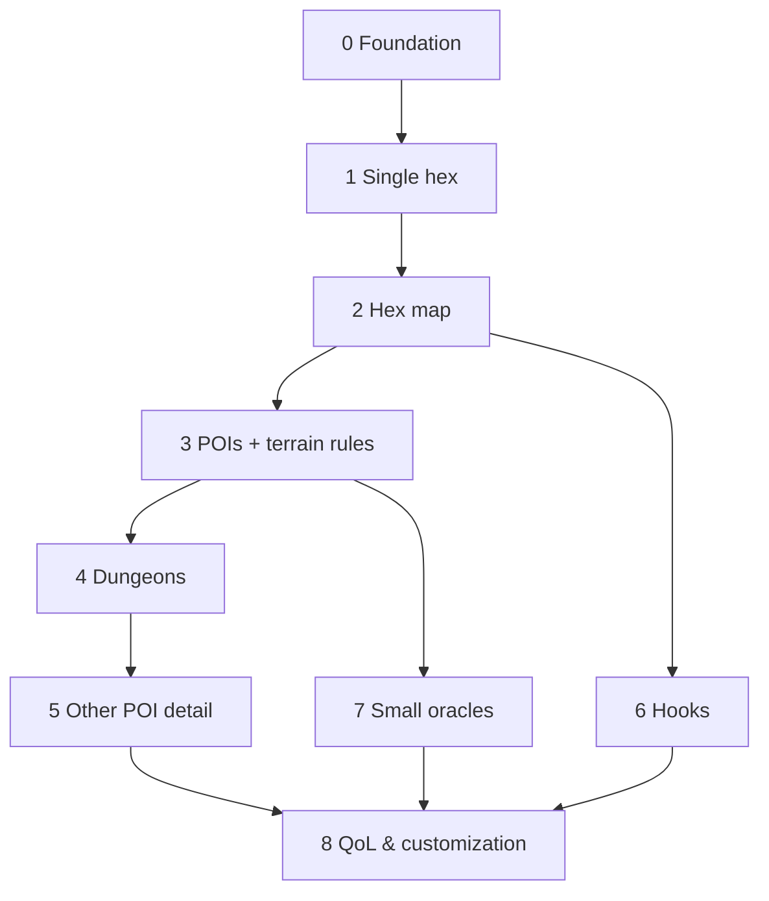

# World Oracle — Master Plan (Overview)

A browser-based **World Oracle** for OSR (Old-School Renaissance) solo and small-group play: a
procedural generation + record-keeping tool. A GM/solo player builds a hex-crawl world piece by
piece — terrain, settlements, points of interest, (later) dungeons, rumors — and the app
remembers the evolving map.

> **This file is the overview.** Per-step detail lives in `docs/plans/` (see
> [Roadmap & status](#roadmap--status)). Completed work is recorded in
> [`docs/plans/phases-0-3.md`](docs/plans/phases-0-3.md).

**Status (current):** Phases 0–5 complete. Phase 4 delivered the full dungeon arc (base interiors +
Dungeon View; themed/explorable 4.5–4.8 arc; the 4.9.1–4.9.14 depth-&-connectivity sub-project —
sizes, room-graphs + loops, doors/secret doors, inter-level + vertical stairs, multiple
entrances/exits, rich room contents, exploration state + GM notes, lighting + occupied frontier,
tiered monster roster + dens, depth/difficulty scaling, dice-notation treasure, named-den
signatures). **Phase 5 detailed the other POI types** (see
[phase-5-poi-detail.md](docs/plans/phase-5-poi-detail.md)): a shared, terrain-aware **Tier-1
description engine** for **shrine / camp / landmark** (`js/gen/feature-detail.js`), and **towers** as
a **Tier-2 mapped interior** (`js/gen/tower.js`) that reuses the Dungeon View with an `orientation:"up"`
flag — floors that climb, a garrison from the POI's occupant, and the master on top. The standalone
`lair` POI type was retired (folded into dungeon den themes). **In progress: Phase 6 — Hooks** (Type-1
local adventure hooks; see [phase-6-hooks.md](docs/plans/phase-6-hooks.md)). **6.1** (foundation: schema
**v6** + the **Known** pattern + a settlement Hooks panel), **6.2** (the **Distant** pattern — lazy
target-tile generation: a hook points *n* hexes away and spawns just that one tile), **6.3** (the **Map**
pattern — a treasure map that also reveals a corridor of hexes to the target, plus a "Read map" trigger)
**6.4** (the **Chain** pattern — a breadcrumb hunt that winds clue-by-clue to a named-prize payoff via
"Follow the clue") and **6.5** (verb breadth — **rescue**, **warning**, plus *local* **opportunity** and
**event** hooks) and **6.5b** (**escort** — a two-endpoint delivery to a generated destination) are
built and node-tested. **6.5.1** sharpened the hook target line — POI **base name** (occupant split
off), distance in **miles**, target **terrain** — and **removed the accuracy/"GM:" line** (off-ness is
left to GM judgement + future travel rules). A global always-visible open-hooks list (→ Target / ↩ Origin
jumps) ties them together. Remaining: **6.5.2** (threat reframing + reward axis) and **6.6** (return
trips + lifecycle/map polish). **Schema v6. 177 `node --test` passing.** Work merges to **`main`** via PR.

---

## Foundational decisions (confirmed)

| Decision | Choice |
|---|---|
| **Stack** | Client-only, **vanilla HTML/CSS/JS (ES modules), no build step**. Canvas map, HTML panels. |
| **Persistence** | Browser **IndexedDB** (+ `localStorage` for prefs). **JSON export/import**. Fully offline. |
| **Ruleset** | **System-agnostic OSR** — generic terms, no system-specific stat blocks. |
| **Group play** | **Single GM screen**; solo uses the same screen. No backend/networking. |
| **Tables** | **Data-driven** — content in JSON tables rolled by a generic engine. In-app editing is Phase 8. |
| **Dependencies** | **No npm runtime deps.** Node is **dev-only** (test runner + static server). |

**Guiding principles:** vertical slices (each step is usable); engine vs. content separation;
YAGNI; everything persists.

---

## Hard conventions (a new session MUST know these)

- **No build, no runtime deps.** Plain ES modules loaded by the browser. Node is only for
  `node --test` and a static server.
- **Serve over HTTP — never `file://`.** ES `import`, `fetch()` of `/data/*.json`, and IndexedDB
  all need a real origin. Use `./run-local.sh` (or `python3 -m http.server`).
- **Testing:** pure logic (`js/core`, `js/gen`, `js/world`, `js/data/portability.js`) is unit
  tested with **`node --test`** (zero deps). Browser-only code (`js/ui/*`, `js/data/db.js`) is
  verified by hand in the browser — **not** node-tested.
- **Seeded determinism.** A world has a `seed`. Per-element generation uses
  `subRng(seed, "hex", q, r, …)` (order-independent). `gen` counter on a hex lets "regenerate"
  produce a different result deterministically. **Render-time choices (which art variant) are
  derived from coords and NOT stored.**
- **Schema + migration.** `SCHEMA_VERSION` (currently **5**) lives in `js/world/world.js`.
  `migrateWorld()` in `js/data/portability.js` upgrades older worlds and runs on both import and
  load. Bump + add a migration step whenever the persisted shape changes.
- **Data-driven content.** Roll tables are JSON in `/data` using the
  [canonical schema](#canonical-table-schema). *Rules* (per-terrain settlement caps / POI weights,
  terrain adjacency) are small pure JS consts (`js/gen/terrain-profile.js`,
  `js/gen/terrain-affinity.js`), not tables.
- **Art = SVG assets with emoji fallback.** Terrain/settlement motifs are coloured-pencil SVGs in
  `assets/`; the renderer falls back to emoji until an image loads / if one is missing. POIs are
  emoji.
- **Design / approval loop:** brainstorm → plan → **approve** → build → `node --test` → commit +
  push to the branch (updates PR #1) → **present a manual test checklist for the user to run via
  `./run-local.sh`** (see [How to run & test](#how-to-run--test)). **Visual changes are reviewed
  as files first** (a preview is sent for sign-off before art is wired in). One coherent step per
  commit.

---

## Architecture & file map (as built)

```
index.html                      app shell (command bar, <canvas id="map">, side panel)
css/app.css
run-local.sh                    fetch latest branch, run node --test, serve over HTTP
package.json                    dev-only: "type":"module", scripts: test / serve
/js
  /core   rng.js (mulberry32, hashString, makeRng, subRng, randInt, pick)
          dice.js (rollDice)   table.js (validateTable, rollTable)   loader.js (loadTables, makeResolver)
          hexgeo.js (axial<->pixel, cube rounding, neighbors, axialKey/parseKey)
  /gen    hex.js (generateHex, weightedTerrainTable)   poi.js (generatePoi)
          terrain-profile.js (per-terrain rules + DUNGEON_THEME_BIAS, SHRINE/CAMP/LANDMARK bias+skin)
          terrain-affinity.js (adjacency)
          dungeon.js (generateDungeon, DUNGEON_BUILD)   dungeon-layout.js (layoutLevel, deriveDoors)
          feature-detail.js (describeFeature/featureName/featureDescription — Tier-1 shrine/camp/landmark)
          tower.js (generateTower, TOWER_BUILD — Tier-2 mapped tower interior, orientation:"up")
  /world  world.js (createWorld, SCHEMA_VERSION, getHex/hasHexAt/placedHexes/addHex/removeHex)
  /data   db.js (IndexedDB)    portability.js (exportWorld/importWorld/migrateWorld)
  /ui     app.js (bootstrap/wiring; dungeon view toggle + lazy build)   map.js (canvas renderer + LOD)
          panel.js (selection UI + dungeon/room view)   dungeon-map.js (dungeon canvas: camera, grid)
          terrain-style.js / terrain-art.js / poi-style.js (+ THEME_GLYPHS) / settlement-art.js
/data     terrain, swamp-feature, settlement-size, poi-types, poi-occupant, creatures, occupiers,
          dungeon-{size,theme,room,trap,special,dressing,treasure,treasure-guard,monster-status,light},
          monster-families, dungeon-family,
          shrine-{form,dedication,condition,detail}, camp-{scale,reaction},
          landmark-{feature,trait,hook}, tower-{kind,master} (JSON)
/assets   terrain/*.svg  settlement/*.svg
/test     node --test suites (rng, dice, table, world, hexgeo, hex, terrain-weight,
          terrain-profile, terrain-art, settlement-art, poi, migration, dungeon, dungeon-layout,
          feature-detail, tower)
/docs/plans  per-step sub-plans (this overview links them)
```

**Data flow:** UI command → generator (`js/gen`, reads JSON tables + seeded RNG) → result →
written into the World (`js/world`) → persisted to IndexedDB → rendered to canvas + panel.



---

## Current data model (as built, schema v5)

- **World:** `{ schemaVersion:5, id, name, seed, hexScale, hexes:{}, createdAt, updatedAt }`
  (IndexedDB holds a **list** of worlds). No `factions` (deferred).
- **Hex** (keyed by `axialKey(q,r)` = `"q,r"`):
  `{ key, coords:{q,r}, placed, terrain, terrainFeature|null, settlement, pois:[], explored, gen }`.
- **settlement:** `{ present:false }` or `{ present:true, size }` where size ∈
  `Thorp, Hamlet, Village, Town, City` (capped per terrain; none on Water).
- **POI:** `{ id:"poi:<n>", type, name, occupant, detail }`; `occupant` is
  `{kind:"lair",creature}` | `{kind:"occupied",by}` | `{kind:"none"}`. **Dungeon** POIs carry a
  terrain-biased `detail.theme` (drives the map glyph) and gain a generated interior at
  `detail.dungeon`, built lazily on first open. **Tower** POIs likewise build a mapped interior at
  `detail.dungeon` (with `orientation:"up"`, `build:TOWER_BUILD`) on open. **Shrine / camp / landmark**
  carry structured **Tier-1 detail** at `detail.feature` (`{build, type, …axis picks…}`); prose is
  composed at render. All interiors/features self-heal from a build stamp (no schema bump). Auto-gen
  places ≤1 POI; users add/remove more.
- **Terrains:** Forest, Plains, Hills, Mountains, Swamp, Desert, Water. **POI types:** dungeon,
  shrine, camp, landmark, tower. The explorable types **ruin/cave/mine — and creature lairs —
  merged into `dungeon` as themes** (Ruin, Cave complex, Abandoned mine, Beast den, Ogre lair, …).
  The standalone `lair` POI type was retired in Phase 5.1 (a creature lair is now a dungeon den).

### Canonical table schema
```json
{ "id": "terrain", "title": "Terrain type",
  "entries": [ { "weight": 4, "value": "Forest" },
               { "weight": 1, "value": "Swamp", "roll": { "table": "swamp-feature" } } ] }
```
`weight` (default 1), `value` (string or object), optional `roll` (nested sub-table).

---

## Roadmap & status

| Phase | Status | Detail |
|---|---|---|
| 0 — Foundation & app shell | ✅ done | [phases-0-3.md](docs/plans/phases-0-3.md) |
| 1 — Single hex generator | ✅ done | [phases-0-3.md](docs/plans/phases-0-3.md) |
| 2 — Hex map (+2.1 interaction, +2.2 terrain look) | ✅ done | [phases-0-3.md](docs/plans/phases-0-3.md) |
| 3 — POIs + terrain-aware gen (+3.1–3.5 POIs/art/LOD) | ✅ done | [phases-0-3.md](docs/plans/phases-0-3.md) |
| **4 — Dungeons** (base + 4.5–4.8 arc + 4.9.1–4.9.14 sub-project) | ✅ done | [phase-4-dungeons.md](docs/plans/phase-4-dungeons.md), [phase-4.9-dungeon-connectivity.md](docs/plans/phase-4.9-dungeon-connectivity.md) |
| **5 — Other POI types detailed** (shrine/camp/landmark + tower) | ✅ done | [phase-5-poi-detail.md](docs/plans/phase-5-poi-detail.md) |
| **6 — Hooks** (Type-1 local adventure hooks; sub-steps 6.1–6.6) | 🔨 in progress (6.1) | [phase-6-hooks.md](docs/plans/phase-6-hooks.md) |
| 7 — Additional small oracles | ◻ later | see catalog below |
| 8 — QoL & customization (editable tables, notes, themes) | ◻ later | — |

Phases 0→1→2→3→4→5 are a hard chain; 6/7 need only the map + POIs; 8 is polish. **Factions were
deliberately deferred** out of Phase 3 (see backlog).

**Phase 4 (done) — Dungeons:** a dungeon POI carries a terrain-biased theme (map glyph) and opens
into a multi-level **Dungeon View** — per-level room-graph maps with loops, doors/secret doors,
inter-level stairs (true vertical) + level-skip shafts, multiple entrances/exits, lighting, and
richly stocked rooms (themed monster families with depth/difficulty scaling, dice-notation
treasure & number-appearing, named-den signature creatures), plus exploration state + GM notes.
See [phase-4-dungeons.md](docs/plans/phase-4-dungeons.md) and
[phase-4.9-dungeon-connectivity.md](docs/plans/phase-4.9-dungeon-connectivity.md).

**Phase 5 (done) — Other POI types detailed:** two tiers. **Tier 1** — `shrine`, `camp`, `landmark`
generate a terrain-aware **composable description** (independent axes × a terrain "skin") via a shared
pure engine (`js/gen/feature-detail.js`); picks are stored on `poi.detail.feature`, prose is composed
at render, and a `FEATURE_BUILD` stamp self-heals older saves on open (no schema bump). **Tier 2** —
`tower` opens into a **mapped interior** (`js/gen/tower.js`) that reuses the Dungeon View and layout
engine with an `orientation:"up"` flag: a stack of narrow floors that climb (index 0 = ground/entrance,
master on top), garrisoned by the POI's occupant (held = lit, empty = dark). `lair` retired (a creature
lair is now a dungeon den). See [phase-5-poi-detail.md](docs/plans/phase-5-poi-detail.md).

**Phase 6 (in progress) — Hooks** (renamed from "Rumors"): Type-1 **local adventure hooks** — a
**resolution pattern** (Known / Distant / Map / Chain / Return) × a **verb** (explore, threat,
opportunity, rescue, warning, escort, event), pointing at an existing or freshly-generated hex/POI. The
signature mechanic is **lazy target-tile generation** (point at a tile that doesn't exist yet → generate
just that tile). It's a **GM-only tool**, so a hook's reliability is a **GM-visible `accuracy`**
(accurate / off-by-one / false) — weighted reliable, "wrong" is usually a positional error, not a lie.
Generation is a **manual "Generate hook" button** (context-sensitive: settlement gossip vs camp/dungeon
"Read map"); auto-generation waits on a future Travel feature. Type-2 "distant powers" (roaming/region/
news-propagation) is deferred to the Factions phase. Sub-steps **6.1–6.6**; **6.1 (foundation) built**.
See [phase-6-hooks.md](docs/plans/phase-6-hooks.md) and the
[small-oracle catalog](#small-oracle-catalog-for-phase-7-selection).

---

## Small-oracle catalog (for Phase 7 selection)

- **Solo core:** Yes/No fate oracle; random event / inspiration; plot/quest hook.
- **World & travel:** weather; wilderness encounter; travel/journey events; region/realm;
  calendar / time & travel tracker.
- **Settlements & people:** settlement details; NPC; tavern/shop; name generators.
- **Encounters & rewards:** reaction & morale; dungeon dressing; treasure/loot; magic item;
  mishap/complication.
- **Living world (stretch):** faction turn / doom clock.

---

## Backlog — other ideas (discussed, not yet scheduled)

- **Factions** — a dedicated phase: generation **plus operating rules** (goals advancing,
  disposition, holdings, faction turns/doom clock, reuse of one faction across the map). POIs
  currently use generic occupier labels only; no faction objects exist.
- **Hydrology** — lakes vs seas by size, salt/fresh, coastlines / contiguous water (Water is a
  single flat terrain today).
- **Party position marker** — needs exploration/travel rules first.
- **Art** — pencil sketches for POIs; optional "full painted hex"; eventual "pencil-drawn"
  refinement of tiles; optional 3rd terrain variant; an `svg-tile` authoring skill for consistency.
- **POI indicator polish** — make the zoomed-out red dot a count, or recolour it.
- **Misc** — allow a manual settlement on Water (currently disallowed); more terrain types.
- **Phase 8 items** — user-editable/custom tables, map labels/notes, search, undo, themes,
  print/GM-screen view.

---

## How to run & test

### Run it
- **Run locally:** `./run-local.sh` (fetches the branch, runs `node --test`, then serves on
  `http://localhost:8000` — aborts if tests fail). Needs `git`, `node`, `python3`. The script
  self-updates to the latest branch tip each run (hard reset — it's a tester's script, not for
  local edits). Override the port: `./run-local.sh 9000`.
- **Tests only:** `node --test` (or `npm test`).
- **Never** open `index.html` via `file://` (modules/`fetch`/IndexedDB need an HTTP origin).

### How a step is verified (the loop, every step)
The container here can't expose a browser, so verification is split:
1. **Automated:** `node --test` covers all pure logic; it must stay green and is the gate in
   `run-local.sh`.
2. **Manual browser:** because UI/canvas/IndexedDB aren't node-tested, **each step ends by
   presenting the user a short numbered/checkbox test checklist** to run via `./run-local.sh`.
   The user ticks items (or reports issues) before we move on. Keep checklists concrete and
   tied to the change.

**Standard manual-verification recipe** (adapt per step):
- Serve via `./run-local.sh`; drive the new feature's UI and confirm the on-screen result.
- **Reload** → state persists (IndexedDB). **Export → re-import** JSON → round-trips
  (`schemaVersion` current). Same seed → reproducible generation.
- Map changes: check pan/zoom, click-select, and the zoom **LOD tiers** (sketches → simplified
  markers → nothing), plus the **Icons** toggle.

**Example checklist shape** (what to hand the user):
```
[ ] <do X in the UI> → <expected on-screen result>
[ ] Reload → <state> persists
[ ] Export → re-import → identical
```

## Out of scope (for now)

Accounts, servers, real-time multiplayer, native apps, system-specific stat blocks, AI/LLM text
generation, and any npm runtime dependency or build step.
