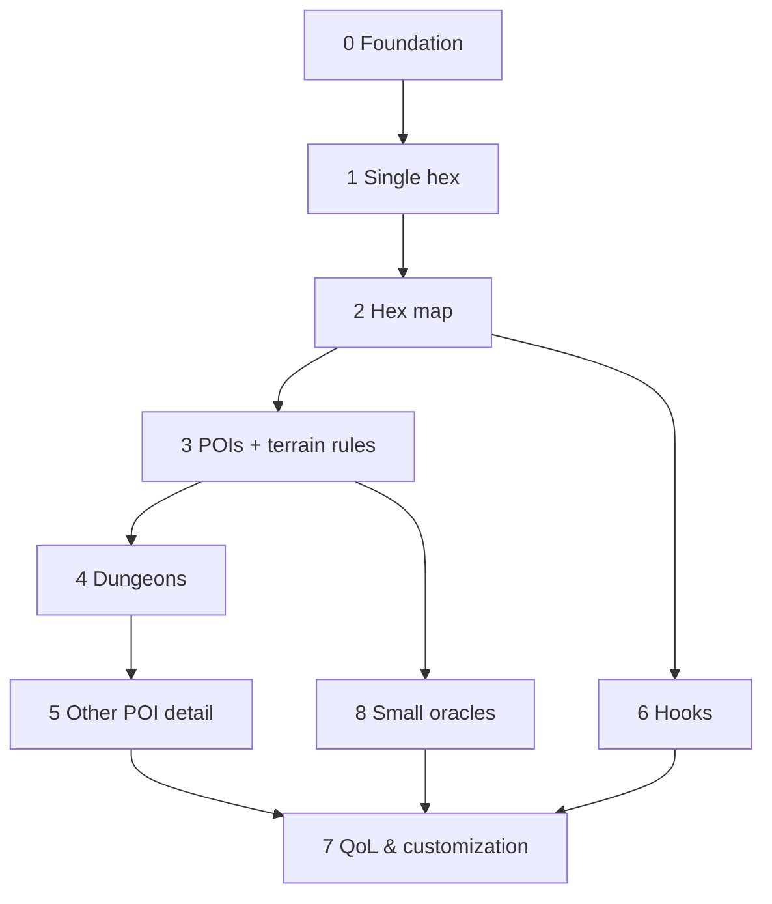

# World Oracle — Master Plan (Overview)

A browser-based **World Oracle** for OSR (Old-School Renaissance) solo and small-group play: a
procedural generation + record-keeping tool. A GM/solo player builds a hex-crawl world piece by
piece — terrain, settlements, points of interest, (later) dungeons, rumors — and the app
remembers the evolving map.

> **This file is the overview.** Per-step detail lives in `docs/plans/` (see
> [Roadmap & status](#roadmap--status)). Completed work is recorded in
> [`docs/plans/phases-0-3.md`](docs/plans/phases-0-3.md).

**Status (current):** Phases 0–6 complete. Phase 4 delivered the full dungeon arc (base interiors +
Dungeon View; themed/explorable 4.5–4.8 arc; the 4.9.1–4.9.14 depth-&-connectivity sub-project —
sizes, room-graphs + loops, doors/secret doors, inter-level + vertical stairs, multiple
entrances/exits, rich room contents, exploration state + GM notes, lighting + occupied frontier,
tiered monster roster + dens, depth/difficulty scaling, dice-notation treasure, named-den
signatures). **Phase 5 detailed the other POI types** (see
[phase-5-poi-detail.md](docs/plans/phase-5-poi-detail.md)): a shared, terrain-aware **Tier-1
description engine** for **shrine / camp / landmark** (`js/gen/feature-detail.js`), and **towers** as
a **Tier-2 mapped interior** (`js/gen/tower.js`) that reuses the Dungeon View with an `orientation:"up"`
flag — floors that climb, a garrison from the POI's occupant, and the master on top. **Phase 6 — Hooks complete** (Type-1 local
adventure hooks; see [phase-6-hooks.md](docs/plans/phase-6-hooks.md)): a manual **"Generate hook"** at a
town (plus **"Read map"** / **"Follow a trail"** anywhere) produces a hook of one of several **kinds** —
**known**, **distant** (lazy target-tile generation), **map** (a revealed corridor), **chain**
(a breadcrumb hunt to a named prize), local **opportunity** / **event**, two-endpoint **escort**, and
**return** (a development at a known place) — across the verbs explore / threat / rescue / warning. A
threat names its **menace** ("Threat: Bandits", tracked to its lair); threat/rescue/escort carry a
**reward** (a patron + coin, or glory). Each hook reads with the target's base name, distance in **miles**,
and tile **terrain**. A global always-visible **open-hooks list** (→ Target /
↩ Origin / Follow-the-clue) and **amber map markers** on every open target tie it together. New `world.hooks`
(schema **v6**), pure `js/gen/hooks.js`. **Phase 7 — QoL & UX started: 7.1 right-click radial menu**
is done (see [phase-7.1-radial-menu.md](docs/plans/phase-7.1-radial-menu.md)) — right-click a tile for a
**fixed-slot ring** of its actions (Terrain / POI / Settlement / Hook / Neighbours / Regenerate / Delete /
Generate); inapplicable slots are **greyed-out (never hidden)** with a reason, submenus open as a **second
outer ring**, and a submenu's "Random" anchors nearest the cursor. Pure model `js/ui/radial-model.js`
(node-tested), overlay `js/ui/radial-menu.js`; no schema change. **Phase 3R — world coherence started:
3R.1 "Generate Area" radial tool is done** (see [phase-3r-world-coherence.md](docs/plans/phase-3r-world-coherence.md)) —
folded into the existing **"Generate" slot** (Random + **Small/Medium/Large** hex-radius disc, radius
1/2/3), always **fill-empty only**; new `hexRing`/`hexDisc` geometry in `js/core/hexgeo.js`; v1 rides
current per-hex generation unchanged — it's the testing aid for 3R.2+ (terrain v2, fresh/salt water &
coastlines, rivers, roads, richer settlements). The freed-up former "Neighbours" slot is now a
`reserved` placeholder (kept so the ring's other 7 slots don't shift) awaiting a future feature (e.g.
travel). **3R.2 (audit + research + world-model decision) is done**: audited today's
generation against the code (found `terrainBias`, the neighbour-affinity multiplier, defaults to `1`
and is never set elsewhere — coherence is stuck at its weakest setting), researched external
hex-generation mechanics (AD&D DMG transition tables, Welsh Piper's hierarchical dominant-terrain,
The Alexandrian's region/chunk method, elevation+moisture Whittaker-style biome classification), built
a stats baseline (`test/stats-harness.js`, run via `node test/stats-harness.js`, **not** part of
`node --test`/`npm test` — see note below) showing a **23–25% lone-hex rate** and settlements
averaging **~1.1–1.2 hexes** apart, and **decided the world-building model: two-layer elevation +
moisture** (coordinate-hashed noise fields, order-independent by construction — feeds 3R.4's sea level
and 3R.5's downhill rivers with no rework). **3R.3 (terrain generation v2) is done**: `js/core/noise.js`
(`valueNoise2D`/`fbm2D`, 3-octave value noise, no npm deps) + `js/gen/biome.js` (`biomeAt`/
`classifyBiome`, a percentile-calibrated Whittaker-style classifier) give every hex a first-class
`elevation`/`moisture` (schema **v8**) that's a **pure function of `(seed, q, r)`** — replacing the old
neighbour-affinity roll (`weightedTerrainTable`/`TERRAIN_AFFINITY`/`terrainBias`, now deleted) outright.
Measured result: **lone-hex rate 23–25% → 2–3%**, **Mountains mean clump size 2.1 → 7.6–13.6** (real
ranges, not speckle) — see [phase-3r-world-coherence.md](docs/plans/phase-3r-world-coherence.md) for the
full before/after. **3R.4 (water v2) is done**: Water split into **Lake (fresh) / Sea (salt)** — two
full terrain values (rendering needs zero signature changes that way), sharing Water's settlement/POI
rules via a new `biasKey()` alias in `terrain-profile.js` so no bias table had to be duplicated. Since
this world is **infinite and generated incrementally** (unlike every reference generator, which
flood-fills a fixed map edge), Lake vs Sea is decided by a coarse `continent` noise field
(`js/gen/biome.js`) rather than flood-fill — order-independent by construction, with no connectivity
search or reclassification risk. **Revised after manual testing caught "inland seas"**: the first pass
decided Sea vs Lake from a field independent of elevation, so Sea read as an oversized lake with no
relationship to an actual landmass edge. Fixed by using `continent` as a pure land/ocean **gate**
(never blended into elevation) — below threshold is always Sea, otherwise the *unchanged* 3R.3 land
classifier runs, with its own low-elevation band now always meaning Lake. Verified: Sea now forms 1–3
genuinely large contiguous bodies (up to ~3200 hexes) per sample, real coastlines rather than scattered
pockets. Also added a smooth land bias around the fixed world spawn `(0,0)` — some seeds otherwise put
the origin itself in open ocean. **Sea contagion added on top**: placing (or generating) a Sea hex now
makes nearby future generation more likely to continue the coastline (`js/gen/biome.js`
`rollSeaContagion`, ~75% chance per already-placed Sea neighbour, compounding, always leaving room for
land to randomly break through) — verified end-to-end (forcing Sea then filling a Large area around it
turned the whole area to Sea in one real run). This is a deliberate, narrowly-scoped exception to
"terrain is a pure function of `(seed, q, r)`" — Sea near existing content now depends on generation
history, everything else stays position-pure. **3R.5 (rivers) is done**: `js/gen/river.js` traces
mountain-peak sources downhill (steepest descent, smoothed with fewer FBM octaves so it tracks real
landform slope) to a Lake/Sea sink, or forces a landlocked depression to become a **Lake** (no carving
in v1). A fully analytical per-hex query (scan candidate sources within a radius, trace each) measured
**~28ms/hex** in the scratchpad — too slow for interactive area generation — so rivers instead **reuse
the sea-contagion propagation pattern**: a hex checks only its own local peak/source status (O(1)) and
whether an already-placed neighbour already has a river edge pointing into it (O(6)), growing
`hex.riverEdges` forward as hexes are generated rather than recomputing a path from scratch. Measured
**0.037ms/hex** (~750× faster). This is a **second** deliberate exception to position-purity — for
raw performance this time, not manual-placement responsiveness. Density tuned for "rare and dramatic"
(`RIVER_SOURCE_CHANCE`, originally 0.06, ~1 source per 1200–2000 hexes). **Rendering pulled forward
from 3R.8 on request** (a river you can't see isn't testable) — `map.js`'s `drawRiverEdges` draws a
line per `riverEdges` direction from a hex's center to the midpoint between its center and that
neighbour's (the true shared-edge midpoint on any regular hex grid, no corner lookup needed), styled
cyan over a dark outline so it reads over any terrain colour. **Revised twice more after real GM
use:** (1) 0.06 was too rare — ~50 "Generate Area" clicks (~1350 hexes) gave only 1 short river;
considered fixing the underlying order-dependent propagation gap with a "pendingRivers" side-channel,
but traced through it carefully (and confirmed via a scratchpad simulation of realistic scattered-click
usage) that it would add **zero value** — the only loss case (a hex explored before the river that
would have flowed through it existed) can't be fixed without rewriting already-placed map content,
which stays off the table. Simply bumped `RIVER_SOURCE_CHANCE` to **0.25** (~4×) instead — same
simulation shows a ~1350-hex map going from under 1 river on average to 3–4, still clearly a landmark.
(2) Bends looked like sharp corners (two straight lines meeting at the hex center); `drawRiverEdges`
now draws a pass-through hex's two edges as **one quadratic curve using the hex's own center as the
control point** — bends smoothly on an actual turn, and degenerates to a perfectly straight line for
opposite edges with no special-casing (the center sits exactly on that line for a regular hex). Verified
visually — a continuous multi-hex river renders correctly from a mountain source downhill, and a
synthetic 4-shape test (straight/bend/source/confluence) confirmed each renders as designed.
**Third revision (real-play bug report): one-hex orphan stubs and rivers dead-ending in
Plains/Hills instead of Lake/Sea.** Diagnosed against an actual exported world: every case
traced back to a river's downhill edge pointing at a neighbour ALREADY PLACED (a separate
earlier click, or the same click processed a moment earlier) before the river existed — its
`incomingRiverEdges` look-back scan had already run and found nothing. Gets worse the more of
a map is already explored in small increments. **Fix (confirmed with the user first, since it
bends a previously-firm rule): `js/ui/app.js`'s `stitchRiverForward`** retroactively extends a
river edge into an already-placed, still-river-free neighbour — purely cosmetic (never touches
terrain/settlement/POIs, never overwrites another river's data), capped at 20 cascaded hops.
This is a THIRD deliberate exception to position-purity, and the first that touches an
already-placed hex at all (the other two only ever affect a hex at its own generation moment).
Verified: scratchpad simulation of realistic scattered-click usage showed mean chain length
1.68→4.46 hexes, one-hex orphans 27→7 (-74%), chains reaching real water 1→5 (5×); a real
40-click browser session then confirmed 0 orphans, mean length 9.75, longest 15 hexes, no
console errors. **Next:
3R.6** (settlements v2 — names, Keep/Fort, river/coast size boosts) **or more
Phase 7** (search, undo, print/GM view, themes — see [phase-7-backlog.md](docs/plans/phase-7-backlog.md);
in-app custom tables were dropped).
**Map notes & labels (7.5) add `name`/`note` to a hex — schema bumped to v7; 3R.3 adds
`elevation`/`moisture` (v8); 3R.4 adds `continent` (renamed from `basin`) and splits Water into
Lake/Sea (v9, reworked in v10); 3R.5 adds `riverEdges` (v11).**
**Schema v11. 262 `node --test` passing** (run as `test/*.test.js` — `node --test`'s default discovery
treats any file under `test/` as a suite, which would otherwise snag the non-test
`stats-harness.js` diagnostic script). Work merges to **`main`** via PR.

---

## Foundational decisions (confirmed)

| Decision | Choice |
|---|---|
| **Stack** | Client-only, **vanilla HTML/CSS/JS (ES modules), no build step**. Canvas map, HTML panels. |
| **Persistence** | Browser **IndexedDB** (+ `localStorage` for prefs). **JSON export/import**. Fully offline. |
| **Ruleset** | **System-agnostic OSR** — generic terms, no system-specific stat blocks. |
| **Group play** | **Single GM screen**; solo uses the same screen. No backend/networking. |
| **Tables** | **Data-driven** — content in JSON tables rolled by a generic engine. In-app editing is Phase 7. |
| **Dependencies** | **No npm runtime deps.** Node is **dev-only** (test runner + static server). |

**Guiding principles:** vertical slices (each step is usable); engine vs. content separation;
YAGNI; everything persists.

---

## Hard conventions (a new session MUST know these)

- **No build, no runtime deps.** Plain ES modules loaded by the browser. Node is only for
  `node --test` and a static server.
- **Serve over HTTP — never `file://`.** ES `import`, `fetch()` of `/data/*.json`, and IndexedDB
  all need a real origin. Use `./run-local.sh` (or `python3 -m http.server`).
- **Testing:** pure logic (`js/core`, `js/gen`, `js/world`, `js/data/portability.js`) is unit
  tested with **`node --test`** (zero deps). Browser-only code (`js/ui/*`, `js/data/db.js`) is
  verified by hand in the browser — **not** node-tested.
- **Seeded determinism.** A world has a `seed`. Per-element generation uses
  `subRng(seed, "hex", q, r, …)` (order-independent). `gen` counter on a hex lets "regenerate"
  produce a different result deterministically. **Render-time choices (which art variant) are
  derived from coords and NOT stored.**
- **Schema + migration.** `SCHEMA_VERSION` (currently **11**) lives in `js/world/world.js`.
  `migrateWorld()` in `js/data/portability.js` upgrades older worlds and runs on both import and
  load. Bump + add a migration step whenever the persisted shape changes.
- **No backward-compatibility burden right now.** Pre-release, with no real worlds worth
  preserving: don't write migrations for old export formats, don't worry about whether cached
  IndexedDB data matches the current shape — a schema/shape change can just break old worlds; the
  fix is to start a new one. Skip defensive fallbacks/back-compat shims for data shape changes for
  the same reason. **Revisit this once there's real save data worth protecting** — this note
  itself should be removed at that point.
- **Data-driven content.** Roll tables are JSON in `/data` using the
  [canonical schema](#canonical-table-schema). *Rules* (per-terrain settlement caps / POI weights,
  terrain coherence via elevation+moisture) are small pure JS consts/functions
  (`js/gen/terrain-profile.js`, `js/gen/biome.js`, `js/core/noise.js`), not tables.
- **Art = SVG assets with emoji fallback.** Terrain/settlement motifs are coloured-pencil SVGs in
  `assets/`; the renderer falls back to emoji until an image loads / if one is missing. POIs are
  emoji.
- **Design / approval loop:** brainstorm → plan → **approve** → build → `node --test` → commit +
  push to the branch (updates its PR) → **present a manual test checklist for the user to run via
  `./run-local.sh`** (see [How to run & test](#how-to-run--test)). **Visual changes are reviewed
  as files first** (a preview is sent for sign-off before art is wired in). One coherent step per
  commit.

---

## Architecture & file map (as built)

```
index.html                      app shell (command bar, <canvas id="map">, side panel)
css/app.css
run-local.sh                    fetch latest branch, run node --test, serve over HTTP
package.json                    dev-only: "type":"module", scripts: test / serve
/js
  /core   rng.js (mulberry32, hashString, makeRng, subRng, randInt, pick)
          dice.js (rollDice)   table.js (validateTable, rollTable)   loader.js (loadTables, makeResolver)
          hexgeo.js (axial<->pixel, cube rounding, neighbors, hexRing/hexDisc, axialDistance, axialLine, axialKey/parseKey)
          noise.js (valueNoise2D, fbm2D — Phase 3R.3 deterministic coordinate-hashed value noise)
  /gen    hex.js (generateHex)   poi.js (generatePoi)
          terrain-profile.js (per-terrain rules + DUNGEON_THEME_BIAS, SHRINE/CAMP/LANDMARK bias+skin)
          biome.js (biomeAt/classifyLand/elevationAt — Phase 3R.3/3R.4 elevation+moisture -> land terrain,
                    `continent` coarse noise field gates Sea vs. running the land classifier)
          river.js (isRiverSource/downhillDirection/riverStateAt — Phase 3R.5 mountain-to-sink rivers,
                    propagated incrementally like sea contagion for performance, not analytically traced)
          dungeon.js (generateDungeon, DUNGEON_BUILD)   dungeon-layout.js (layoutLevel, deriveDoors)
          feature-detail.js (describeFeature/featureName/featureDescription — Tier-1 shrine/camp/landmark)
          tower.js (generateTower, TOWER_BUILD — Tier-2 mapped tower interior, orientation:"up")
          hooks.js (generateHook/startChain/buildChainStep/buildLocalHook/buildEscortHook, rollHookPattern,
                    chooseDistantTarget, hookName/hookDescription, HOOK_BUILD — Phase 6 adventure hooks)
  /world  world.js (createWorld, SCHEMA_VERSION, getHex/hasHexAt/placedHexes/addHex/removeHex; world.hooks)
  /data   db.js (IndexedDB)    portability.js (exportWorld/importWorld/migrateWorld)
  /ui     app.js (bootstrap/wiring; dungeon view + lazy build; hook generation + map marks; radial dispatch)   map.js (canvas renderer + LOD + hook markers + river lines (3R.5); right-click → radial)
          panel.js (selection UI + dungeon/room view + global hooks list)   dungeon-map.js (dungeon canvas: camera, grid)
          radial-model.js (pure fixed-slot menu model — Phase 7.1)   radial-menu.js (right-click ring overlay)
          terrain-style.js / terrain-art.js / poi-style.js (+ THEME_GLYPHS) / settlement-art.js
/data     terrain, swamp-feature, settlement-size, poi-types, poi-occupant, creatures, occupiers,
          dungeon-{size,theme,room,trap,special,dressing,treasure,treasure-guard,monster-status,light},
          monster-families, dungeon-family,
          shrine-{form,dedication,condition,detail}, camp-{scale,reaction},
          landmark-{feature,trait,hook}, tower-{kind,master},
          hook-{pattern,verb,source,explore,threat,rescue,warning,opportunity,commodity,event,cargo,recipient,clue,payoff,patron,reward,return} (JSON)
/assets   terrain/*.svg  settlement/*.svg
/test     node --test suites, run as `test/*.test.js` (rng, dice, table, world, hexgeo, hex,
          noise, biome, river, terrain-coherence, terrain-profile, terrain-art, settlement-art, poi,
          migration, dungeon, dungeon-layout, feature-detail, tower, hooks); stats-harness.js is a
          diagnostic script
          (not a suite — `node --test`'s directory-based discovery would otherwise pick up ANY
          file under test/, hence the explicit `*.test.js` glob), run via `node
          test/stats-harness.js [seed] [radius]` (3R.2 — terrain/settlement generation baseline)
/docs/plans  per-step sub-plans (this overview links them)
```

**Data flow:** UI command → generator (`js/gen`, reads JSON tables + seeded RNG) → result →
written into the World (`js/world`) → persisted to IndexedDB → rendered to canvas + panel.



---

## Current data model (as built, schema v11)

- **World:** `{ schemaVersion:11, id, name, seed, hexScale, hexes:{}, hooks:[], createdAt, updatedAt }`
  (IndexedDB holds a **list** of worlds). No `factions` (deferred).
- **Hook** (Phase 6; top-level `world.hooks[]`):
  `{ id:"hook:<n>", build, pattern, verb, subject:{poiId?,name,type}, origin:{q,r}, target:{q,r,poiId?},
  bearing, distance, targetTerrain, claim, source, status }` plus per-kind fields — `chain:{total,step,prize}`,
  `path:[{q,r}]` (map corridor), `lair` (threat), `cargo` + `reward:{patron,amount}|{glory}` (escort/bounty).
  `pattern` ∈ known/distant/map/chain/opportunity/event/escort/return; `status` ∈ open/resolved/ignored.
  Prose composed at render (`hookName`/`hookDescription`).
- **Hex** (keyed by `axialKey(q,r)` = `"q,r"`):
  `{ key, coords:{q,r}, placed, terrain, terrainFeature|null, elevation, moisture, continent, riverEdges,
  settlement, pois:[], explored, gen, name?, note? }`. `name`/`note` (v7) are optional GM annotations —
  `name` shows as a map label. `elevation`/`moisture` (v8) and `continent` (v9, renamed from `basin` in
  v10; floats in `[0,1)`) are the Phase 3R.3/3R.4 biome-classifier inputs — pure functions of
  `(seed, q, r)`, always present regardless of how terrain was chosen. `continent` is a coarse,
  continent-scale land/ocean **gate** (not flood-fill — this world is infinite/incrementally generated,
  so there's no map edge to flood-fill from): below a threshold it's always Sea; otherwise the unchanged
  land classifier runs, and its own low-elevation band means Lake. A smooth bias keeps the fixed world
  origin `(0,0)` always land. `riverEdges` (v11) is an array of `NEIGHBOR_DIRS` indices (0-5) marking
  which hex-sides carry a river segment — grown incrementally from mountain-peak sources as neighbouring
  hexes are generated (`js/gen/river.js`), the same propagation shape as sea contagion, chosen for
  performance (a fully analytical per-hex query measured ~28ms/hex, too slow for interactive area
  generation; incremental propagation measures ~0.037ms/hex).
- **settlement:** `{ present:false }` or `{ present:true, size }` where size ∈
  `Thorp, Hamlet, Village, Town, City` (capped per terrain; none on Lake/Sea).
- **POI:** `{ id:"poi:<n>", type, name, occupant, detail }`; `occupant` is
  `{kind:"lair",creature}` | `{kind:"occupied",by}` | `{kind:"none"}`. **Dungeon** POIs carry a
  terrain-biased `detail.theme` (drives the map glyph) and gain a generated interior at
  `detail.dungeon`, built lazily on first open. **Tower** POIs likewise build a mapped interior at
  `detail.dungeon` (with `orientation:"up"`, `build:TOWER_BUILD`) on open. **Shrine / camp / landmark**
  carry structured **Tier-1 detail** at `detail.feature` (`{build, type, …axis picks…}`); prose is
  composed at render. All interiors/features self-heal from a build stamp (no schema bump). Auto-gen
  places ≤1 POI; users add/remove more.
- **Terrains:** Forest, Plains, Hills, Mountains, Swamp, Desert, Lake, Sea (Water split into Lake/Sea
  in 3R.4; Lake and Sea share Water's settlement/POI rules via `terrain-profile.js`'s `biasKey()`
  alias). **POI types:** dungeon, shrine, camp, landmark, tower. The explorable types **ruin/cave/mine
  — and creature lairs — are `dungeon` themes** (Ruin, Cave complex, Abandoned mine, Beast den, Ogre
  lair, …).

### Canonical table schema
```json
{ "id": "terrain", "title": "Terrain type",
  "entries": [ { "weight": 4, "value": "Forest" },
               { "weight": 1, "value": "Swamp", "roll": { "table": "swamp-feature" } } ] }
```
`weight` (default 1), `value` (string or object), optional `roll` (nested sub-table).

---

## Roadmap & status

| Phase | Status | Detail |
|---|---|---|
| 0 — Foundation & app shell | ✅ done | [phases-0-3.md](docs/plans/phases-0-3.md) |
| 1 — Single hex generator | ✅ done | [phases-0-3.md](docs/plans/phases-0-3.md) |
| 2 — Hex map (+2.1 interaction, +2.2 terrain look) | ✅ done | [phases-0-3.md](docs/plans/phases-0-3.md) |
| 3 — POIs + terrain-aware gen (+3.1–3.5 POIs/art/LOD) | ✅ done | [phases-0-3.md](docs/plans/phases-0-3.md) |
| **4 — Dungeons** (base + 4.5–4.8 arc + 4.9.1–4.9.14 sub-project) | ✅ done | [phase-4-dungeons.md](docs/plans/phase-4-dungeons.md), [phase-4.9-dungeon-connectivity.md](docs/plans/phase-4.9-dungeon-connectivity.md) |
| **5 — Other POI types detailed** (shrine/camp/landmark + tower) | ✅ done | [phase-5-poi-detail.md](docs/plans/phase-5-poi-detail.md) |
| **6 — Hooks** (Type-1 local adventure hooks; sub-steps 6.1–6.6) | ✅ done | [phase-6-hooks.md](docs/plans/phase-6-hooks.md) |
| 7 — QoL & UX (notes, nav, themes; ~~custom tables~~ dropped) | ▶ **in progress** | **7.1 radial menu ✅** [phase-7.1-radial-menu.md](docs/plans/phase-7.1-radial-menu.md) · **7.2 dungeon-view UX ✅** [phase-7.2-dungeon-view-ux.md](docs/plans/phase-7.2-dungeon-view-ux.md) · **7.3 panel tabs ✅** [phase-7.3-panel-tabs.md](docs/plans/phase-7.3-panel-tabs.md) · **7.4 pinned hooks + select-to-highlight ✅** [phase-7.4-hooks-pinned-focus.md](docs/plans/phase-7.4-hooks-pinned-focus.md) · **7.5 map notes & labels ✅** [phase-7.5-map-notes.md](docs/plans/phase-7.5-map-notes.md) · **7.6 map nav & onboarding ✅** [phase-7.6-map-nav-onboarding.md](docs/plans/phase-7.6-map-nav-onboarding.md) · **7.7+ backlog 📋** [phase-7-backlog.md](docs/plans/phase-7-backlog.md) |
| **3R — World coherence** (terrain/water/settlements/roads/rivers) | ▶ **in progress** | [phase-3r-world-coherence.md](docs/plans/phase-3r-world-coherence.md) — revisit of Phase 3; pure-engine, node-tested; interleaves with 7. **3R.1 "Generate Area" ✅ · 3R.2 audit+research+model-decision ✅ · 3R.3 terrain v2 ✅ · 3R.4 water v2 ✅ · 3R.5 rivers ✅** (Lake/Sea via a `continent` land/ocean gate — revised after manual testing found "inland seas"; real coastlines now; rivers grow incrementally from mountain sources like sea contagion, for performance; schema v11); next 3R.6 (settlements v2). |
| 8 — Additional small oracles | ◻ later | see catalog below |

Phases 0→1→2→3→4→5 are a hard chain; 6/8 need only the map + POIs; 7 is polish. Factions are a
dedicated future phase (see backlog).

**Phase 4 (done) — Dungeons:** a dungeon POI carries a terrain-biased theme (map glyph) and opens
into a multi-level **Dungeon View** — per-level room-graph maps with loops, doors/secret doors,
inter-level stairs (true vertical) + level-skip shafts, multiple entrances/exits, lighting, and
richly stocked rooms (themed monster families with depth/difficulty scaling, dice-notation
treasure & number-appearing, named-den signature creatures), plus exploration state + GM notes.
See [phase-4-dungeons.md](docs/plans/phase-4-dungeons.md) and
[phase-4.9-dungeon-connectivity.md](docs/plans/phase-4.9-dungeon-connectivity.md).

**Phase 5 (done) — Other POI types detailed:** two tiers. **Tier 1** — `shrine`, `camp`, `landmark`
generate a terrain-aware **composable description** (independent axes × a terrain "skin") via a shared
pure engine (`js/gen/feature-detail.js`); picks are stored on `poi.detail.feature`, prose is composed
at render, and a `FEATURE_BUILD` stamp self-heals older saves on open (no schema bump). **Tier 2** —
`tower` opens into a **mapped interior** (`js/gen/tower.js`) that reuses the Dungeon View and layout
engine with an `orientation:"up"` flag: a stack of narrow floors that climb (index 0 = ground/entrance,
master on top), garrisoned by the POI's occupant (held = lit, empty = dark). See
[phase-5-poi-detail.md](docs/plans/phase-5-poi-detail.md).

**Phase 6 (done) — Hooks** (renamed from "Rumors"): Type-1 **local adventure hooks** — a **kind**
(Known / Distant / Map / Chain / Return, plus local Opportunity / Event and two-endpoint Escort) × a
**verb** (explore / threat / rescue / warning), pointing at an existing or freshly-generated hex/POI. The
signature mechanic is **lazy target-tile generation** (point at a tile that doesn't exist yet → generate
just that tile; Map also reveals a corridor). A **threat** names its menace (tracked to its lair) and
threat/rescue/escort carry a **reward** (patron + coin, or glory). A hook reads with the target's base
name, distance in **miles**, and tile **terrain**. Generation is a **manual "Generate hook"** at a town, plus **"Read map"** /
**"Follow a trail"** anywhere; auto-generation waits on a future Travel feature. A global **open-hooks
list** (→ Target / ↩ Origin / Follow-the-clue) and **amber map markers** tie it together. Type-2 "distant
powers" (roaming/region/news-propagation) belong to the future Factions phase. See
[phase-6-hooks.md](docs/plans/phase-6-hooks.md) and the
[small-oracle catalog](#small-oracle-catalog-for-phase-8-selection).

---

## Small-oracle catalog (for Phase 8 selection)

- **Solo core:** Yes/No fate oracle; random event / inspiration; plot/quest hook.
- **World & travel:** weather; wilderness encounter; travel/journey events; region/realm;
  calendar / time & travel tracker.
- **Settlements & people:** settlement details; NPC; tavern/shop; name generators.
- **Encounters & rewards:** reaction & morale; dungeon dressing; treasure/loot; magic item;
  mishap/complication.
- **Living world (stretch):** faction turn / doom clock.

---

## Backlog — other ideas (discussed, not yet scheduled)

- **Factions** — a dedicated phase: generation **plus operating rules** (goals advancing,
  disposition, holdings, faction turns/doom clock, reuse of one faction across the map). POIs
  currently use generic occupier labels only; no faction objects exist.
- **Hydrology, terrain coherence, rivers, roads, richer settlements** — now planned as
  **Phase 3R** ([phase-3r-world-coherence.md](docs/plans/phase-3r-world-coherence.md)): fresh/salt
  water & coastlines, terrain v2, rivers, roads, settlement spacing/names/Keep-Fort/clusters.
- **Party position marker** — needs exploration/travel rules first.
- **Art** — pencil sketches for POIs; optional "full painted hex"; eventual "pencil-drawn"
  refinement of tiles; optional 3rd terrain variant; an `svg-tile` authoring skill for consistency.
- **Misc** — allow a manual settlement on Lake/Sea (currently disallowed); more terrain types.
- **Phase 7 items** — search, undo, print/GM-screen view, themes, POI-dot polish, radial
  keyboard/touch parity (see [phase-7-backlog.md](docs/plans/phase-7-backlog.md)). In-app custom
  tables were **dropped**.

---

## How to run & test

### Run it
- **Run locally:** `./run-local.sh` (fetches the branch, runs `node --test`, then serves on
  `http://localhost:8000` — aborts if tests fail). Needs `git`, `node`, `python3`. The script
  self-updates to the latest branch tip each run (hard reset — it's a tester's script, not for
  local edits). Override the port: `./run-local.sh 9000`.
- **Tests only:** `node --test test/*.test.js` (or `npm test`). (Plain `node --test` also picks up
  `test/stats-harness.js` — a diagnostic, not a suite — since Node's default discovery treats any
  file under `test/` as fair game; the glob avoids that.)
- **Never** open `index.html` via `file://` (modules/`fetch`/IndexedDB need an HTTP origin).

### How a step is verified (the loop, every step)
The container here can't expose a browser, so verification is split:
1. **Automated:** `node --test` covers all pure logic; it must stay green and is the gate in
   `run-local.sh`.
2. **Manual browser:** because UI/canvas/IndexedDB aren't node-tested, **each step ends by
   presenting the user a short numbered/checkbox test checklist** to run via `./run-local.sh`.
   The user ticks items (or reports issues) before we move on. Keep checklists concrete and
   tied to the change.

**Standard manual-verification recipe** (adapt per step):
- Serve via `./run-local.sh`; drive the new feature's UI and confirm the on-screen result.
- **Reload** → state persists (IndexedDB). **Export → re-import** JSON → round-trips
  (`schemaVersion` current). Same seed → reproducible generation.
- Map changes: check pan/zoom, click-select, and the zoom **LOD tiers** (sketches → simplified
  markers → nothing), plus the **Icons** toggle.

**Example checklist shape** (what to hand the user):
```
[ ] <do X in the UI> → <expected on-screen result>
[ ] Reload → <state> persists
[ ] Export → re-import → identical
```

## Out of scope (for now)

Accounts, servers, real-time multiplayer, native apps, system-specific stat blocks, AI/LLM text
generation, and any npm runtime dependency or build step.
