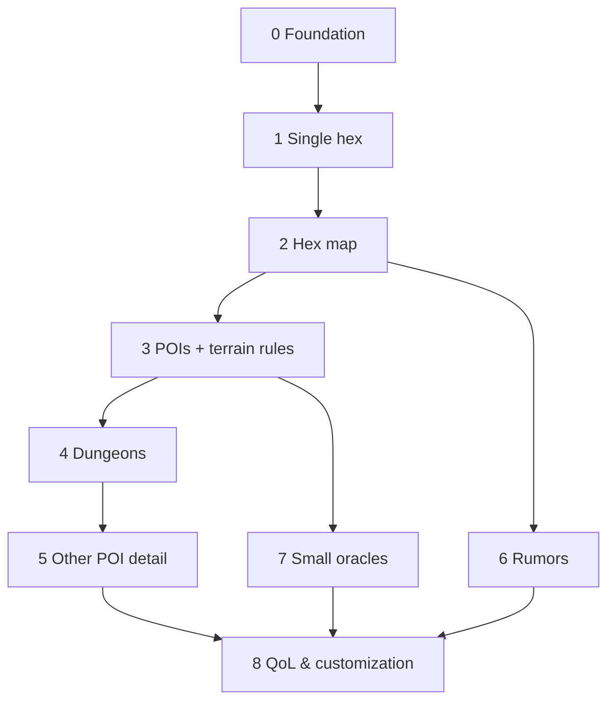

# World Oracle — Master Plan (Overview)

A browser-based **World Oracle** for OSR (Old-School Renaissance) solo and small-group play: a
procedural generation + record-keeping tool. A GM/solo player builds a hex-crawl world piece by
piece — terrain, settlements, points of interest, (later) dungeons, rumors — and the app
remembers the evolving map.

> **This file is the overview.** Per-step detail lives in `docs/plans/` (see
> [Roadmap & status](#roadmap--status)). Completed work is recorded in
> [`docs/plans/phases-0-3.md`](docs/plans/phases-0-3.md).

**Status (current):** Phases 0–3 complete (engine, persistence, visual hex map, terrain with
pencil-art tiles, POIs with terrain-aware rules, settlements with sketch/zoom LOD). **Schema
v3. 81 `node --test` passing.** Work is on branch `claude/refine-local-plan-lg3hiu` (PR #1).
**Next: Phase 4 — Dungeons.**

---

## Foundational decisions (confirmed)

| Decision | Choice |
|---|---|
| **Stack** | Client-only, **vanilla HTML/CSS/JS (ES modules), no build step**. Canvas map, HTML panels. |
| **Persistence** | Browser **IndexedDB** (+ `localStorage` for prefs). **JSON export/import**. Fully offline. |
| **Ruleset** | **System-agnostic OSR** — generic terms, no system-specific stat blocks. |
| **Group play** | **Single GM screen**; solo uses the same screen. No backend/networking. |
| **Tables** | **Data-driven** — content in JSON tables rolled by a generic engine. In-app editing is Phase 8. |
| **Dependencies** | **No npm runtime deps.** Node is **dev-only** (test runner + static server). |

**Guiding principles:** vertical slices (each step is usable); engine vs. content separation;
YAGNI; everything persists.

---

## Hard conventions (a new session MUST know these)

- **No build, no runtime deps.** Plain ES modules loaded by the browser. Node is only for
  `node --test` and a static server.
- **Serve over HTTP — never `file://`.** ES `import`, `fetch()` of `/data/*.json`, and IndexedDB
  all need a real origin. Use `./run-local.sh` (or `python3 -m http.server`).
- **Testing:** pure logic (`js/core`, `js/gen`, `js/world`, `js/data/portability.js`) is unit
  tested with **`node --test`** (zero deps). Browser-only code (`js/ui/*`, `js/data/db.js`) is
  verified by hand in the browser — **not** node-tested.
- **Seeded determinism.** A world has a `seed`. Per-element generation uses
  `subRng(seed, "hex", q, r, …)` (order-independent). `gen` counter on a hex lets "regenerate"
  produce a different result deterministically. **Render-time choices (which art variant) are
  derived from coords and NOT stored.**
- **Schema + migration.** `SCHEMA_VERSION` (currently **3**) lives in `js/world/world.js`.
  `migrateWorld()` in `js/data/portability.js` upgrades older worlds and runs on both import and
  load. Bump + add a migration step whenever the persisted shape changes.
- **Data-driven content.** Roll tables are JSON in `/data` using the
  [canonical schema](#canonical-table-schema). *Rules* (per-terrain settlement caps / POI weights,
  terrain adjacency) are small pure JS consts (`js/gen/terrain-profile.js`,
  `js/gen/terrain-affinity.js`), not tables.
- **Art = SVG assets with emoji fallback.** Terrain/settlement motifs are coloured-pencil SVGs in
  `assets/`; the renderer falls back to emoji until an image loads / if one is missing. POIs are
  emoji.
- **Design / approval loop:** brainstorm → plan → **approve** → build → `node --test` → commit +
  push to the branch (updates PR #1). **Visual changes are reviewed as files first** (a preview is
  sent for sign-off before art is wired in). One coherent step per commit.

---

## Architecture & file map (as built)

```
index.html                      app shell (command bar, <canvas id="map">, side panel)
css/app.css
run-local.sh                    fetch latest branch, run node --test, serve over HTTP
package.json                    dev-only: "type":"module", scripts: test / serve
/js
  /core   rng.js (mulberry32, hashString, makeRng, subRng, randInt, pick)
          dice.js (rollDice)   table.js (validateTable, rollTable)   loader.js (loadTables, makeResolver)
          hexgeo.js (axial<->pixel, cube rounding, neighbors, axialKey/parseKey)
  /gen    hex.js (generateHex, weightedTerrainTable)   poi.js (generatePoi)
          terrain-profile.js (per-terrain rules)        terrain-affinity.js (adjacency matrix)
  /world  world.js (createWorld, SCHEMA_VERSION, getHex/hasHexAt/placedHexes/addHex/removeHex)
  /data   db.js (IndexedDB)    portability.js (exportWorld/importWorld/migrateWorld)
  /ui     app.js (bootstrap/wiring)   map.js (canvas renderer + LOD)   panel.js (selection UI)
          terrain-style.js / terrain-art.js / poi-style.js / settlement-art.js
/data     terrain, swamp-feature, settlement-size, poi-types, poi-occupant, creatures, occupiers (JSON)
/assets   terrain/*.svg  settlement/*.svg
/test     node --test suites (rng, dice, table, world, hexgeo, hex, terrain-weight,
          terrain-profile, terrain-art, settlement-art, poi, migration)
/docs/plans  per-step sub-plans (this overview links them)
```

**Data flow:** UI command → generator (`js/gen`, reads JSON tables + seeded RNG) → result →
written into the World (`js/world`) → persisted to IndexedDB → rendered to canvas + panel.



---

## Current data model (as built, schema v3)

- **World:** `{ schemaVersion:3, id, name, seed, hexScale, hexes:{}, createdAt, updatedAt }`
  (IndexedDB holds a **list** of worlds). No `factions` (deferred).
- **Hex** (keyed by `axialKey(q,r)` = `"q,r"`):
  `{ key, coords:{q,r}, placed, terrain, terrainFeature|null, settlement, pois:[], explored, gen }`.
- **settlement:** `{ present:false }` or `{ present:true, size }` where size ∈
  `Thorp, Hamlet, Village, Town, City` (capped per terrain; none on Water).
- **POI:** `{ id:"poi:<n>", type, name, occupant, detail }`; `occupant` is
  `{kind:"lair",creature}` | `{kind:"occupied",by}` | `{kind:"none"}`; dungeon POIs carry
  `detail.stub.phase=4` until Phase 4. Auto-gen places ≤1 POI; users add/remove more by hand.
- **Terrains:** Forest, Plains, Hills, Mountains, Swamp, Desert, Water. **POI types:** dungeon,
  lair, ruin, shrine, camp, landmark, tower, mine, cave.

### Canonical table schema
```json
{ "id": "terrain", "title": "Terrain type",
  "entries": [ { "weight": 4, "value": "Forest" },
               { "weight": 1, "value": "Swamp", "roll": { "table": "swamp-feature" } } ] }
```
`weight` (default 1), `value` (string or object), optional `roll` (nested sub-table).

---

## Roadmap & status

| Phase | Status | Detail |
|---|---|---|
| 0 — Foundation & app shell | ✅ done | [phases-0-3.md](docs/plans/phases-0-3.md) |
| 1 — Single hex generator | ✅ done | [phases-0-3.md](docs/plans/phases-0-3.md) |
| 2 — Hex map (+2.1 interaction, +2.2 terrain look) | ✅ done | [phases-0-3.md](docs/plans/phases-0-3.md) |
| 3 — POIs + terrain-aware gen (+3.1–3.5 POIs/art/LOD) | ✅ done | [phases-0-3.md](docs/plans/phases-0-3.md) |
| **4 — Dungeons** | ▶ **next** | new `docs/plans/phase-4-dungeons.md` when planned |
| 5 — Other POI types detailed | ◻ later | — |
| 6 — Rumors | ◻ later | — |
| 7 — Additional small oracles | ◻ later | see catalog below |
| 8 — QoL & customization (editable tables, notes, themes) | ◻ later | — |

Phases 0→1→2→3→4→5 are a hard chain; 6/7 need only the map + POIs; 8 is polish. **Factions were
deliberately deferred** out of Phase 3 (see backlog).

**Phase 4 (next) — Dungeons:** dungeon size → number of levels; per level a theme, stocked
contents, and a generated random-monster table; a dungeon detail view. Expands the Phase-3
dungeon stub. Will get its own sub-plan file.

---

## Small-oracle catalog (for Phase 7 selection)

- **Solo core:** Yes/No fate oracle; random event / inspiration; plot/quest hook.
- **World & travel:** weather; wilderness encounter; travel/journey events; region/realm;
  calendar / time & travel tracker.
- **Settlements & people:** settlement details; NPC; tavern/shop; name generators.
- **Encounters & rewards:** reaction & morale; dungeon dressing; treasure/loot; magic item;
  mishap/complication.
- **Living world (stretch):** faction turn / doom clock.

---

## Backlog — other ideas (discussed, not yet scheduled)

- **Factions** — a dedicated phase: generation **plus operating rules** (goals advancing,
  disposition, holdings, faction turns/doom clock, reuse of one faction across the map). POIs
  currently use generic occupier labels only; no faction objects exist.
- **Hydrology** — lakes vs seas by size, salt/fresh, coastlines / contiguous water (Water is a
  single flat terrain today).
- **Party position marker** — needs exploration/travel rules first.
- **Art** — pencil sketches for POIs; optional "full painted hex"; eventual "pencil-drawn"
  refinement of tiles; optional 3rd terrain variant; an `svg-tile` authoring skill for consistency.
- **POI indicator polish** — make the zoomed-out red dot a count, or recolour it.
- **Misc** — allow a manual settlement on Water (currently disallowed); more terrain types.
- **Phase 8 items** — user-editable/custom tables, map labels/notes, search, undo, themes,
  print/GM-screen view.

---

## How to run & test

- **Run locally:** `./run-local.sh` (fetches the branch, runs `node --test`, then serves on
  `http://localhost:8000`). Needs `git`, `node`, `python3`.
- **Tests only:** `node --test` (or `npm test`).
- **Never** open `index.html` via `file://`.

## Out of scope (for now)

Accounts, servers, real-time multiplayer, native apps, system-specific stat blocks, AI/LLM text
generation, and any npm runtime dependency or build step.
