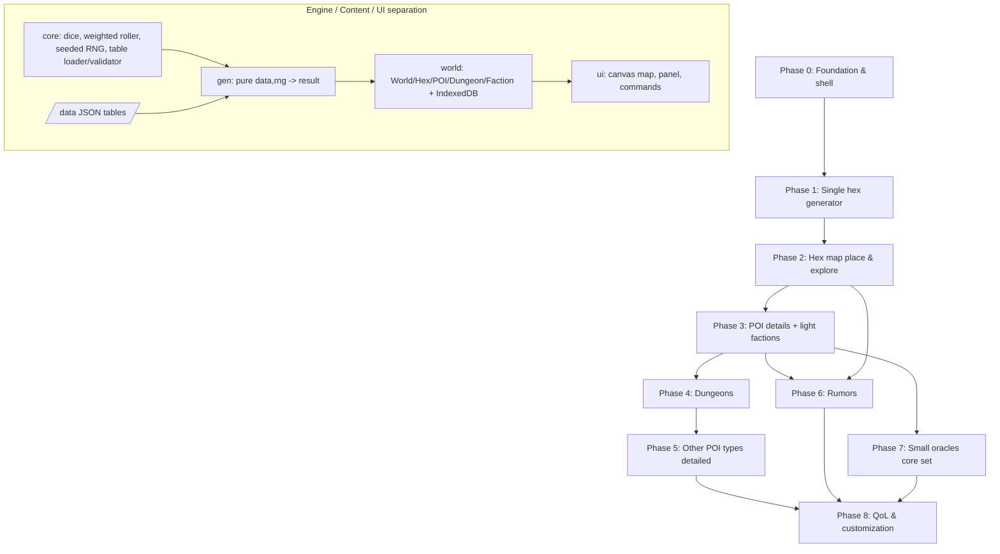

# World Oracle — Master Plan

## Context

A browser-based **World Oracle** for OSR (Old-School Renaissance) solo and small-group
play. It is a procedural generation + record-keeping tool: a GM (or solo player) generates
a hex-crawl world piece by piece — terrain, settlements, points of interest, dungeons,
factions, rumors — and the app remembers the evolving map and its contents.

This document is the **master plan only**: it defines the architecture, the phased build
order, and the catalog of oracle generators. Each phase below gets its **own** brainstorm →
plan → build cycle. We finish and validate each phase before starting the next.

### Foundational decisions (confirmed)

| Decision | Choice |
|---|---|
| **Stack** | Client-only, **vanilla HTML/CSS/JS (ES modules), no build step**. Canvas for the map, HTML for panels/text/buttons. |
| **Persistence** | All state in the browser (**IndexedDB**, with `localStorage` for small prefs). **JSON export/import** for backup and sharing. Fully offline-capable. |
| **Ruleset** | **System-agnostic OSR** — generic terms (terrain, settlement sizes, generic creatures, faction tags). No system-specific stat blocks. |
| **Group play** | **Single GM screen** — one device runs the oracle for the table. Solo uses the same screen. No backend, no networking. |
| **Tables** | **Data-driven** — all content lives in JSON table files, rolled by a generic engine. Shipped read-only first; in-app editing is a later phase. |
| **Dependencies** | **No npm runtime dependencies.** Node is **dev-only** (test runner + static server). Nothing the browser loads comes from a package manager or a build step. |

### Guiding principles

- **Vertical slices.** Each phase ends in something usable, not just plumbing.
- **Engine vs. content separation.** Generators are a thin layer over data tables; adding
  content never means rewriting logic.
- **YAGNI.** No accounts, no server, no real-time until/unless a phase explicitly needs it.
- **Everything persists.** Generated results are saved to the world, not thrown away.

---

## Architecture sketch

```
index.html
/css      app styling
/js
  /core   dice + weighted-table roller, seeded RNG, table loader, schema helpers
  /data   persistence (IndexedDB wrapper), JSON export/import
  /world  domain model: World, Hex (axial coords), Settlement, POI, Dungeon, Faction
  /gen    generators (one module per oracle), each = pure(data, rng) -> result
  /ui     map renderer (canvas), side panel, command buttons, modals
/data     JSON table files (terrain, settlements, POI, occupants, monsters, rumors, …)
/test     Node unit tests for pure core/gen functions (run with `node --test`)
```

**Data flow:** UI command → generator (reads JSON tables, uses seeded RNG) → result object
→ written into World model → persisted to IndexedDB → rendered to canvas + panel.



Phases 0→1→2→3→4→5 are a hard chain. **Phases 5, 7, and 8 are the natural re-orderable /
parallelizable points** — Phase 7 (small oracles) only needs the engine + light factions
(Phase 3), and Phase 6 (rumors) needs the map (Phase 2) and POIs (Phase 3) but not dungeons.

### Hard runtime constraint: serve over HTTP

A no-build ES-module app **cannot run from `file://`**. ES `import`, `fetch()` of JSON
tables, and IndexedDB all require a real HTTP origin (the `file://` origin is "null" and
blocks module loading, fetch, and reliable IndexedDB). **Development and use always go
through a static HTTP server** — `python3 -m http.server` is sufficient; any static server
works. There is still no build step; the server only serves files as-is.

### Table loading & validation (decided in Phase 0)

- **Tables load via `fetch()`** of `/data/*.json` at runtime. (Not JSON-module `import`
  assertions — browser support is uneven and it would couple us to specific runtimes.)
- **Schema validation is a hand-rolled lightweight `validateTable()`** helper in `/js/core`
  — no third-party validator, so we pull in no dependency or build chain. It checks shape
  (entries present, weights numeric/positive, required fields) and fails loudly in dev.

### Canonical weighted-table schema

All content uses one table shape so every phase authors tables identically:

```json
{
  "id": "terrain",
  "title": "Terrain type",
  "entries": [
    { "weight": 4, "value": "Forest" },
    { "weight": 3, "value": "Hills" },
    { "weight": 1, "value": "Swamp", "roll": { "table": "swamp-feature" } }
  ]
}
```

- `weight` — relative probability (positive number). Omitted weight defaults to 1.
- `value` — the result (string, or an object for richer entries).
- `roll` (optional) — a nested/sub-table reference (`{ "table": "<id>" }`) the engine rolls
  on after selecting this entry, enabling composition without bespoke logic per generator.

### Seed ↔ persistence (decided in Phase 0)

The seed and persistence serve different jobs and must not be conflated:

- **Persisted results are canonical history.** Once a hex/POI/dungeon is generated it is
  written to the World and is the source of truth; re-rolling never silently overwrites it.
- **The seed exists for reproducible, shareable generation** — a world is identified by name
  + `worldSeed`, so the same seed reproduces the same generation choices.
- **Per-element sub-seeds:** derive a sub-seed from `worldSeed + axial coords` (and element
  id) so a given hex generates deterministically **regardless of the order** the player
  explores the map. Use a small, well-understood PRNG (**mulberry32** or similar) — no
  dependency, a few lines in `/js/core`.

### Core domain model

- `World` — collection of `Hex` keyed by axial coords + metadata (name, hex scale,
  `worldSeed`, **`schemaVersion`**).
- `Hex` — terrain type, optional `Settlement` (with size), zero+ `POI`, explored flag.
- `POI` — type, occupant (creature lair **or** faction), generated details.
- `Dungeon` (a POI subtype) — size → N levels; each level has a theme, stocked contents,
  and its own random-monster table.
- `Faction` — name, tags/goals (light), holdings.

**Persistence shape:** IndexedDB holds a **list of worlds** (not a single world), so the
app supports creating, naming, switching, and deleting worlds. Every exported World JSON
carries a **`schemaVersion`** field so import can detect and (later) migrate older formats.

---

## Phased build order

### Phase 0 — Foundation & app shell
**Goal:** the spine everything hangs on; a window you can open.
- Project scaffold (no build step), ES-module layout as above.
- **Core engine:** dice notation roller, **weighted table roller** (canonical schema +
  nested `roll` support), seeded RNG (mulberry32, per-element sub-seeds), JSON table loader
  via `fetch()` + lightweight `validateTable()`.
- **Persistence:** IndexedDB wrapper storing a **list of worlds** (save/load/switch/delete),
  JSON export/import with `schemaVersion`.
- **App shell:** layout with canvas map area + HTML side panel + command bar. Empty but wired.
- **Testing harness:** `node --test` wired for pure core functions; one passing sample test.
- *Deliverable:* served over HTTP, the app loads, creates/saves/loads a named world (from a
  list), and rolls a test table.

### Phase 1 — Single hex generator
**Goal:** the first real oracle (user bullet #1).
- Generate one hex: **terrain type → settlement chance → settlement size → POI chance**.
- JSON tables for terrain, settlement presence/size, POI presence.
- Result shown as readable text in the side panel and stored on a Hex.
- *Deliverable:* "Generate hex" button produces a complete, saved hex described in text.

### Phase 2 — Hex map: place & explore
**Goal:** turn single hexes into a navigable map (user bullet #2).
- **Canvas hex grid** (pointy-top, configurable mile-scale e.g. 6-mile), pan + zoom, click-select.
  Use the standard pointy-top **axial ↔ pixel** formulas (redblobgames) rather than deriving
  our own coordinate/hit-test math.
- **Place custom hex** on the grid (manual terrain choice).
- **Explore** in a direction → auto-generate the neighbor hex(es).
- **Neighbor-weighted terrain** rules (e.g. forest tends to border forest; coast logic).
- Map state persists and reloads.
- *Deliverable:* a growing, pannable, persistent illustrated hex map.

### Phase 3 — POI details + factions (light)
**Goal:** make POIs meaningful (user bullet #3).
- **POI types** (dungeon, lair, ruin, shrine, camp, landmark, …).
- **Occupant** generation: creature/animal lair **vs.** faction-held.
- **Light faction generator** (name, goal/tags, disposition) — reused later.
- Hex/POI detail view (click a hex → drill into its POIs).
- *Deliverable:* clicking a POI reveals its type and who holds it.

### Phase 4 — Dungeons
**Goal:** deep, structured dungeon POIs (user bullet #4).
- **Dungeon size** (small → very large multi-level) → number of levels.
- **Per level:** theme, stocked contents, and a generated **random-monster table**.
- Dungeon detail view (levels, encounters, monster tables).
- *Deliverable:* a dungeon POI expands into a multi-level stocked dungeon with monster tables.

### Phase 5 — Other POI types detailed
**Goal:** parity of depth for non-dungeon POIs (user bullet #5), reusing the Phase-4 pattern.
- Detail generators for lairs, ruins, shrines, camps, landmarks (lighter than dungeons).
- *Deliverable:* every POI type drills into useful, system-agnostic detail.

### Phase 6 — Rumors
**Goal:** drive play with hooks (user bullet #6).
- **Local rumor** generator (threat/event tied to nearby known hexes — bandits, a lair acting up).
- **Distant rumor** → generate an unexplored far hex with a POI + travel hook, **placed on the
  map** at a distance for the party to seek out.
- *Deliverable:* a "Generate rumor" command yields local or distant, map-aware hooks.

### Phase 7 — Additional small oracles
**Goal:** the "small generators" that round out the toolkit. See catalog below; we pick a
core set and add them here (likely split into a couple of sub-cycles). Strong early
candidates: **Yes/No fate oracle, random event/inspiration oracle, weather, NPC, encounter.**

### Phase 8 — Quality-of-life & customization
**Goal:** polish + open the data up.
- **User-editable / custom tables** (the deferred half of the data-driven decision).
- Map labels/notes, search, undo, themes, print/GM-screen view.
- *Deliverable:* users tailor content and run smoother sessions.

---

## Catalog of additional small oracles (for Phase 7 selection)

Grouped by role; we'll choose a core set when we reach Phase 7.

**Solo-play core (most valuable for solo):**
- **Yes/No fate oracle** — ask a question with a likelihood, get Yes/No + "and/but", plus a
  random-event/complication trigger. The backbone of solo play.
- **Random event / inspiration oracle** — action + theme word pairs to spark interpretation.
- **Plot/quest hook generator** — objective + obstacle + twist.

**World & travel:**
- **Weather oracle** — by terrain + season, with worsening/improving trends.
- **Wilderness encounter generator** — by terrain, tied to the hex.
- **Travel/journey events** — per-watch or per-day events while moving between hexes.
- **Region/realm generator** — zoom-out: name kingdoms/biomes spanning many hexes.
- **Calendar / time & travel tracker** — track days, rations, watches.

**Settlements & people:**
- **Settlement details** — notable features, services, current problem, ruler.
- **NPC generator** — name, appearance, demeanor, motivation, quirk, secret.
- **Tavern/shop generator** — name, patrons, rumors-on-tap.
- **Name generators** — people / places / dungeons.

**Encounters & rewards:**
- **Monster reaction & morale oracle** — turns an encounter into a situation.
- **Dungeon dressing** — room contents, sensory details, traps.
- **Treasure / loot oracle** — hoards, mundane finds.
- **Magic item / relic generator** — system-agnostic wondrous items.
- **Mishap / complication tables** — for failed rolls, hazards.

**Living world (stretch):**
- **Faction turn / doom clock** — factions advance goals over time, evolving the map between sessions.

---

## Verification approach (per phase)

Because this is client-only with no build step, each phase verifies by:
1. **Serve over HTTP** (`python3 -m http.server`, or any static server) and open the page —
   never `file://` (modules, `fetch`, and IndexedDB require a real origin).
2. **Drive the new feature** via its UI command and confirm the on-screen result.
3. **Reload** to confirm persistence (IndexedDB survives refresh).
4. **Export → re-import** JSON to confirm round-trip integrity (including `schemaVersion`).
5. **Unit tests for pure functions** (dice, weighted rolls, seeded RNG, neighbor weighting)
   via **Node's built-in runner (`node --test`)** — no dependencies, since core/gen are plain
   ES modules importable in Node.
6. **Browser-only concerns** (IndexedDB, canvas, UI) via an automated smoke test using the
   **Playwright MCP tools** (load page, click command, assert panel text) once the shell exists.

---

## Out of scope (for now)

Accounts, servers, real-time multiplayer, mobile-native apps, system-specific stat blocks,
AI/LLM text generation, and **any npm runtime dependency or build step** (Node stays
dev-only). Any of these can become a future phase if wanted, but none are needed for the
core tool.

## Next step

On approval, we start **Phase 0** with its own brainstorm → plan → build cycle.
