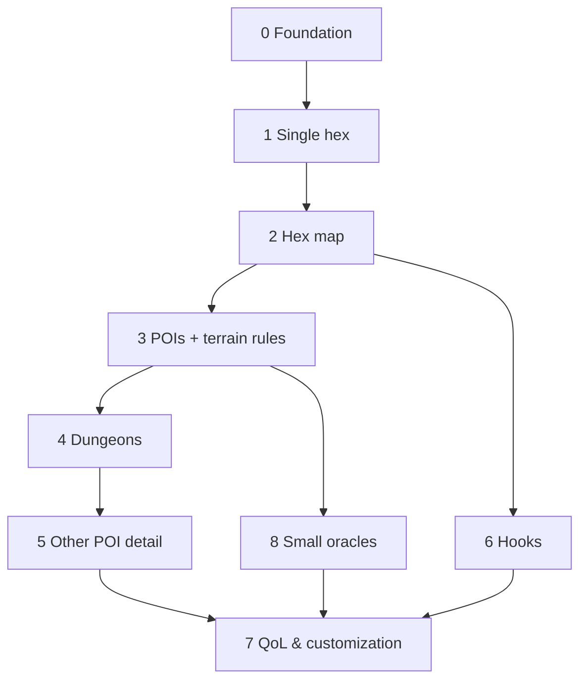

# World Oracle — Master Plan (Overview)

A browser-based **World Oracle** for OSR (Old-School Renaissance) solo and small-group play: a
procedural generation + record-keeping tool. A GM/solo player builds a hex-crawl world piece by
piece — terrain, settlements, points of interest, (later) dungeons, rumors — and the app
remembers the evolving map.

> **This file is the overview.** Per-step detail lives in `docs/plans/` (see
> [Roadmap & status](#roadmap--status)). Completed work is recorded in
> [`docs/plans/phases-0-3.md`](docs/plans/phases-0-3.md).

**Status (current):** Phases 0–6 complete. Phase 4 delivered the full dungeon arc (base interiors +
Dungeon View; themed/explorable 4.5–4.8 arc; the 4.9.1–4.9.14 depth-&-connectivity sub-project —
sizes, room-graphs + loops, doors/secret doors, inter-level + vertical stairs, multiple
entrances/exits, rich room contents, exploration state + GM notes, lighting + occupied frontier,
tiered monster roster + dens, depth/difficulty scaling, dice-notation treasure, named-den
signatures). **Phase 5 detailed the other POI types** (see
[phase-5-poi-detail.md](docs/plans/phase-5-poi-detail.md)): a shared, terrain-aware **Tier-1
description engine** for **shrine / camp / landmark** (`js/gen/feature-detail.js`), and **towers** as
a **Tier-2 mapped interior** (`js/gen/tower.js`) that reuses the Dungeon View with an `orientation:"up"`
flag — floors that climb, a garrison from the POI's occupant, and the master on top. **Phase 6 — Hooks complete** (Type-1 local
adventure hooks; see [phase-6-hooks.md](docs/plans/phase-6-hooks.md)): a manual **"Generate hook"** at a
town (plus **"Read map"** / **"Follow a trail"** anywhere) produces a hook of one of several **kinds** —
**known**, **distant** (lazy target-tile generation), **map** (a revealed corridor), **chain**
(a breadcrumb hunt to a named prize), local **opportunity** / **event**, two-endpoint **escort**, and
**return** (a development at a known place) — across the verbs explore / threat / rescue / warning. A
threat names its **menace** ("Threat: Bandits", tracked to its lair); threat/rescue/escort carry a
**reward** (a patron + coin, or glory). Each hook reads with the target's base name, distance in **miles**,
and tile **terrain**. A global always-visible **open-hooks list** (→ Target /
↩ Origin / Follow-the-clue) and **amber map markers** on every open target tie it together. New `world.hooks`
(schema **v6**), pure `js/gen/hooks.js`. **Phase 7 — QoL & UX started: 7.1 right-click radial menu**
is done (see [phase-7.1-radial-menu.md](docs/plans/phase-7.1-radial-menu.md)) — right-click a tile for a
**fixed-slot ring** of its actions (Terrain / POI / Settlement / Hook / Neighbours / Regenerate / Delete /
Generate); inapplicable slots are **greyed-out (never hidden)** with a reason, submenus open as a **second
outer ring**, and a submenu's "Random" anchors nearest the cursor. Pure model `js/ui/radial-model.js`
(node-tested), overlay `js/ui/radial-menu.js`; no schema change. **Phase 3R — world coherence is
feature-complete (3R.1–3R.8; schema v15); the running log below records each sub-phase as built.**
**3R.1 "Generate Area" radial tool is done** (see [phase-3r-world-coherence.md](docs/plans/phase-3r-world-coherence.md)) —
folded into the existing **"Generate" slot** (Random + **Small/Medium/Large/Huge** hex-radius disc,
radius 1/2/3/15 — Huge added later as a bulk-fill/testing aid, up to 721 hexes in one click, ~36ms
measured), always **fill-empty only**; new `hexRing`/`hexDisc` geometry in `js/core/hexgeo.js`; v1 rides
current per-hex generation unchanged — it's the testing aid for 3R.2+ (terrain v2, fresh/salt water &
coastlines, rivers, roads, richer settlements). The freed-up former "Neighbours" slot is now a
`reserved` placeholder (kept so the ring's other 7 slots don't shift) awaiting a future feature (e.g.
travel). **3R.2 (audit + research + world-model decision) is done**: audited today's
generation against the code (found `terrainBias`, the neighbour-affinity multiplier, defaults to `1`
and is never set elsewhere — coherence is stuck at its weakest setting), researched external
hex-generation mechanics (AD&D DMG transition tables, Welsh Piper's hierarchical dominant-terrain,
The Alexandrian's region/chunk method, elevation+moisture Whittaker-style biome classification), built
a stats baseline (`test/stats-harness.js`, run via `node test/stats-harness.js`, **not** part of
`node --test`/`npm test` — see note below) showing a **23–25% lone-hex rate** and settlements
averaging **~1.1–1.2 hexes** apart, and **decided the world-building model: two-layer elevation +
moisture** (coordinate-hashed noise fields, order-independent by construction — feeds 3R.4's sea level
and 3R.5's downhill rivers with no rework). **3R.3 (terrain generation v2) is done**: `js/core/noise.js`
(`valueNoise2D`/`fbm2D`, 3-octave value noise, no npm deps) + `js/gen/biome.js` (`biomeAt`/
`classifyBiome`, a percentile-calibrated Whittaker-style classifier) give every hex a first-class
`elevation`/`moisture` (schema **v8**) that's a **pure function of `(seed, q, r)`** — replacing the old
neighbour-affinity roll (`weightedTerrainTable`/`TERRAIN_AFFINITY`/`terrainBias`, now deleted) outright.
Measured result: **lone-hex rate 23–25% → 2–3%**, **Mountains mean clump size 2.1 → 7.6–13.6** (real
ranges, not speckle) — see [phase-3r-world-coherence.md](docs/plans/phase-3r-world-coherence.md) for the
full before/after. **3R.4 (water v2) is done**: Water split into **Lake (fresh) / Sea (salt)** — two
full terrain values (rendering needs zero signature changes that way), sharing Water's settlement/POI
rules via a new `biasKey()` alias in `terrain-profile.js` so no bias table had to be duplicated. Since
this world is **infinite and generated incrementally** (unlike every reference generator, which
flood-fills a fixed map edge), Lake vs Sea is decided by a coarse `continent` noise field
(`js/gen/biome.js`) rather than flood-fill — order-independent by construction, with no connectivity
search or reclassification risk. **Revised after manual testing caught "inland seas"**: the first pass
decided Sea vs Lake from a field independent of elevation, so Sea read as an oversized lake with no
relationship to an actual landmass edge. Fixed by using `continent` as a pure land/ocean **gate**
(never blended into elevation) — below threshold is always Sea, otherwise the *unchanged* 3R.3 land
classifier runs, with its own low-elevation band now always meaning Lake. Verified: Sea now forms 1–3
genuinely large contiguous bodies (up to ~3200 hexes) per sample, real coastlines rather than scattered
pockets. Also added a smooth land bias around the fixed world spawn `(0,0)` — some seeds otherwise put
the origin itself in open ocean. **Sea contagion added on top**: placing (or generating) a Sea hex now
makes nearby future generation more likely to continue the coastline (`js/gen/biome.js`
`rollSeaContagion`, ~75% chance per already-placed Sea neighbour, compounding, always leaving room for
land to randomly break through) — verified end-to-end (forcing Sea then filling a Large area around it
turned the whole area to Sea in one real run). This is a deliberate, narrowly-scoped exception to
"terrain is a pure function of `(seed, q, r)`" — Sea near existing content now depends on generation
history, everything else stays position-pure. **3R.5 (rivers) is done**: `js/gen/river.js` traces
mountain-peak sources downhill (steepest descent, smoothed with fewer FBM octaves so it tracks real
landform slope) to a Lake/Sea sink, or forces a landlocked depression to become a **Lake** (no carving
in v1). A fully analytical per-hex query (scan candidate sources within a radius, trace each) measured
**~28ms/hex** in the scratchpad — too slow for interactive area generation — so rivers instead **reuse
the sea-contagion propagation pattern**: a hex checks only its own local peak/source status (O(1)) and
whether an already-placed neighbour already has a river edge pointing into it (O(6)), growing
`hex.riverEdges` forward as hexes are generated rather than recomputing a path from scratch. Measured
**0.037ms/hex** (~750× faster). This is a **second** deliberate exception to position-purity — for
raw performance this time, not manual-placement responsiveness. Density tuned for "rare and dramatic"
(`RIVER_SOURCE_CHANCE`, originally 0.06, ~1 source per 1200–2000 hexes). **Rendering pulled forward
from 3R.8 on request** (a river you can't see isn't testable) — `map.js`'s `drawRiverEdges` draws a
line per `riverEdges` direction from a hex's center to the midpoint between its center and that
neighbour's (the true shared-edge midpoint on any regular hex grid, no corner lookup needed), styled
cyan over a dark outline so it reads over any terrain colour. **Revised twice more after real GM
use:** (1) 0.06 was too rare — ~50 "Generate Area" clicks (~1350 hexes) gave only 1 short river;
considered fixing the underlying order-dependent propagation gap with a "pendingRivers" side-channel,
but traced through it carefully (and confirmed via a scratchpad simulation of realistic scattered-click
usage) that it would add **zero value** — the only loss case (a hex explored before the river that
would have flowed through it existed) can't be fixed without rewriting already-placed map content,
which stays off the table. Simply bumped `RIVER_SOURCE_CHANCE` to **0.25** (~4×) instead — same
simulation shows a ~1350-hex map going from under 1 river on average to 3–4, still clearly a landmark.
(2) Bends looked like sharp corners (two straight lines meeting at the hex center); `drawRiverEdges`
now draws a pass-through hex's two edges as **one quadratic curve using the hex's own center as the
control point** — bends smoothly on an actual turn, and degenerates to a perfectly straight line for
opposite edges with no special-casing (the center sits exactly on that line for a regular hex). Verified
visually — a continuous multi-hex river renders correctly from a mountain source downhill, and a
synthetic 4-shape test (straight/bend/source/confluence) confirmed each renders as designed.
**Third revision (real-play bug report): one-hex orphan stubs and rivers dead-ending in
Plains/Hills instead of Lake/Sea.** Diagnosed against an actual exported world: every case
traced back to a river's downhill edge pointing at a neighbour ALREADY PLACED (a separate
earlier click, or the same click processed a moment earlier) before the river existed — its
`incomingRiverEdges` look-back scan had already run and found nothing. Gets worse the more of
a map is already explored in small increments. **Fix (confirmed with the user first, since it
bends a previously-firm rule): `js/ui/app.js`'s `stitchRiverForward`** retroactively extends a
river edge into an already-placed, still-river-free neighbour — purely cosmetic (never touches
terrain/settlement/POIs, never overwrites another river's data), capped at 20 cascaded hops.
This is a THIRD deliberate exception to position-purity, and the first that touches an
already-placed hex at all (the other two only ever affect a hex at its own generation moment).
Verified: scratchpad simulation of realistic scattered-click usage showed mean chain length
1.68→4.46 hexes, one-hex orphans 27→7 (-74%), chains reaching real water 1→5 (5×); a real
40-click browser session then confirmed 0 orphans, mean length 9.75, longest 15 hexes, no
console errors.
**Fourth revision (real-play request): "longer, windier, real transportation routes" +
lake outflow.** Steepest-descent always picked the single lowest neighbour — every river a
short, direct 5-12 hex line, no meander, no relationship to nearby wetlands or the coast.
`js/gen/river.js`'s `downhillDirection` now scores every valid downhill candidate (still
strictly lower elevation, never uphill) on three factors and makes a seeded weighted-random
pick among them (still a pure, deterministic function of `(seed,q,r)`): elevation drop
(original signal), a swamp/moisture attraction (`SWAMP_ATTRACTION=0.8` — also surfaced and
confirmed a fix where a scratchpad prototype had wrongly treated Swamp, which is LAND, as a
river-stopping body of water like Lake), and a coastward pull toward decreasing `continent`
(`COAST_PULL=150` — `continent` is ~13× coarser than elevation so needs a big multiplier to
matter, but even a faint per-step bias compounds into real large-scale drift toward the sea
over a long path). Added **lake outflow**: a Lake with incoming edges now rolls a chance
(`LAKE_OUTFLOW_CHANCE=0.5` per inflow, compounding — reuses sea contagion's exact shape) to
grow an outgoing edge, letting rivers continue past a lake instead of always stopping there.
A "prefer neighbours that aren't placed yet" bias was also prototyped to help connectivity,
but measured WORSE on every metric in both a single-big-fill and scattered-clicks simulation
(it rushes rivers off the edge of whatever's generated so far) — dropped in favour of relying
on stitching alone, which fully resolves the dead-end case on its own. Verified: combined,
in a single big fill mean chain length 3.8→11.4 hexes, reach-water 15%→59%, orphans 79→7; in
scattered clicks mean length 1.7→5.6, reach-water 2%→18.5%, orphans 110→30; confirmed
visually via the new "Huge" tool (two clearly winding, coastward rivers, real curved bends).
Performance unaffected (~0.02-0.04ms/hex).
**Fifth revision (second real-play round):** (1) **rim overflow** — lake outflow rolls were
passing but silently doing nothing, because a lake sits in a local depression by definition, so
steepest-descent from it is usually -1; lakes now exit by spilling their lowest rim neighbour
(excluding inflow dirs), with a ping-pong guard so the next hex can't point straight back;
`LAKE_OUTFLOW_CHANCE` 0.5→0.75 ("more times than not"). Verified: lakes passed through went
~0→50-70 per 8-map batch. (2) **the "bay" rule** (`js/gen/biome.js`) — lake tiles were
appearing mid-ocean/on the coast because the Lake band ignores the continent gate; a
margin-based fix was prototyped and rejected (it just moves the coastline; adjacency
unchanged), the working rule flood-fills the connected would-be-Lake cluster (bounded, cap 48,
no early exit so all members agree) and turns the WHOLE cluster Sea if it touches raw ocean —
a bay/inlet; verified lakes-adjacent-to-Sea 37→0 across ~39k hexes, still position-pure.
(3) **stitch upgrades** — outgoing edge found as the unmirrored edge (a lake's overflow exit
isn't its downhill), and stitching into a river-carrying hex now adds the incoming edge as a
tributary confluence instead of stopping one hex short. (4) `RIVER_SOURCE_CHANCE` 0.25→0.35
(~8 rivers per large map, per request). (5) **Hexside river rendering** (experiment, on
request): `map.js` `RIVER_STYLE` toggle — rivers along hex BORDERS (rim arcs between
side-midpoints, classic wargame look); after a side-by-side comparison the user preferred the
curves, so `"center"` is active again and hexside stays one word away.
**Sixth revision (third real-play round — "still rivers ending in forests"): two root causes
found by instrumenting full simulated fills.** (1) **Sealed dry basins**: a river descending
into a landlocked basin with a dry Swamp/Forest floor hit `forceLake` at STITCH time, which the
cosmetic-only stitcher dropped — the water then spiralled the pocket via rim-spill and merged
back into itself (an invisible mid-map dead end; measured at a third of all rivers in a filled
region). Fix: the **pristine-hex Lake flip** — a basin hex with no settlement/POIs/name/note
flips to Lake at stitch time (the first and only case where an already-placed hex's terrain
changes, gated on "nothing the GM has invested in"); non-pristine basins spill onward instead.
Verified sealed-dry 29→0 across 10 simulated 5-fill maps. (2) **A stitcher regression** from
the previous commit: `unmatchedOutgoingDir` could return an INCOMING edge whenever the
upstream hex wasn't in the world yet (always true mid-stitch — buildRandomHex stitches before
its caller addHex-es), sending the cascade backward to die one hop in; every river in a real
browser world was 1-2 hexes. Fix: thread the incoming direction (`cameFrom`) through the
cascade and exclude it. Verified in 5 fresh browser worlds: every chain reaches water or the
exploration frontier.
**Seventh revision (fourth real-play round):** (1) **a Lake can now spontaneously ORIGINATE a
river** (`isRiverSource` Lake branch, `LAKE_SOURCE_CHANCE=0.08` per lake hex; ~1.9 lake-origin
chains per Huge fill) — previously impossible, so lakes were never seen as sources;
`riverStateAt`'s Lake branch was restructured so outflow fires on either a passed inflow roll or
a spontaneous source. (2) The **inflow-raises-outflow-likelihood** half was already mechanically
present (`LAKE_OUTFLOW_CHANCE=0.75`, compounding) but invisible; combined with the origin fix it
now shows ~7.3 pass-through lakes (inflow AND outflow) per Huge fill. (3) **Solid blue river
line** (`map.js`): the outline pass is now the river colour too, so it reads as one solid
light-blue stroke — verified in-browser.
**Eighth revision (fifth real-play round — "not enough rivers reach the sea"):** the root cause
was NOT routing but that the sea wasn't in the generated area — a Huge (r15) fill centred on the
origin contained ZERO Sea (measured 0/8), because the origin land-bias guaranteed land out to
radius 30 and the whole fill sat inside that bubble. A long routing sweep (coast-pull to 800,
lake-outflow to 0.95, coast-biased spill, a combined elevation+continent flow field) all capped
at ~10% and the flow-field variant made rivers spiral (maxLen 300+) — so it was left un-applied.
**Fix: `FALLOFF_RADIUS` 30 → 15** (`js/gen/biome.js`) — the origin and its inner rings stay
reliably land (origin never Sea across 40 seeds; r3 start disc always land), but coastline now
appears within a starting Huge fill in ~55% of maps (avg ~180 Sea hexes, up from ~0). Real
near-origin Huge fills now average 177 Sea hexes and ~15% reach-sea, with ≥1 sea-reaching river
in ~30% of maps (~60% by radius 25); confirmed visually.
**Ninth revision (sixth real-play round — "not enough rivers reach the sea; discuss why before
changing more"): the whole per-hex flow model was REPLACED with curated tracing.** Paused and
diagnosed with the user that the ~10-15% reach-sea ceiling was an ARCHITECTURAL wall, not a tuning
miss: `elevation` and `continent` are independent noise fields, so "locally downhill" wanders at
random relative to the coast and rivers get trapped in the countless local elevation minima long
before they descend to the sea; five distinct emergent approaches all capped at ~10-15%, and a
prototyped seaward-elevation-slope (the user's first pick) hit the same 14% wall while banding
mountains into unnatural coast-parallel walls. **The fix (user chose it): trace each source to the
sea up front.** New `js/gen/river-trace.js` runs a minimax "fill and spill" (priority-flood) from a
source, always expanding the frontier reachable over the LOWEST elevation pass — exactly how water
fills a basin and spills its lowest rim, repeatedly, until it escapes; the first ocean hex reached
(target = `biome.js` new `isOceanAt` gate) gives the drainage route. Minimax on ELEVATION (not
continent) follows the valleys and threads the lowest saddles, so a river almost never crosses high
ground (~14% of path hexes on Mountains/Hills, mostly the legitimate source descent) — continent-
minimax cut across mountains a third of the time and looked broken. Scratchpad: **100% of ~380
sources reach the sea** across a dozen maps, mean path ~110 hexes, ~870 elevation samples/trace
(paid once when a source is discovered). Rivers are now a top-level `world.rivers[]` registry
(`{id, source, path, reachedSea}`, schema **v12**), populated by `app.js`'s `syncRivers` after every
generation batch and on world load (idempotent, keyed by source; migrated worlds rebuild from their
existing source hexes). `map.js`'s `drawRivers` renders each as one smooth blue polyline through the
hex centres — **including across unexplored hexes**, so a river visibly reaches the coast even when
the sea itself hasn't been generated — with a bounding-box viewport cull. The per-hex flow model
(`downhillDirection`, `riverStateAt`, lake-overflow, `stitchRiverForward`, `hex.riverEdges`) and its
tests were removed; `river.js` keeps only source detection (`isRiverSource`). Verified in-browser:
a Huge fill yields ~19-47 long winding rivers, 100% traced to sea; a coastal seed shows multiple
rivers visibly flowing into a rendered Sea body. **Follow-up (immediate real-play — "a lot of rivers
almost cross and look like spaghetti"): tributary merging.** Independent traces from nearby sources
found near-identical lowest-pass routes to the same coast and ran near-parallel/crossing. Fix:
`syncRivers` now traces sources in **canonical (sorted) order sharing one `claimed` set**, and
`traceRiverToSea` terminates on reaching a claimed hex (a **confluence** — the tributary joins that
trunk and its downstream is drawn once). Result is a dendritic network: scratchpad measured **82% of
rivers join a trunk, 81% less line drawn**, distinct river hexes 2391→667, with ~7 sea-reaching
trunks per large map. Order-independent (canonical, not generation order); the whole network rebuilds
when the source set changes (`world.riversMerged` forces a one-time rebuild of pre-merge worlds).
Confirmed in-browser on the same seed as the spaghetti shot — clean confluences, no parallel bundles.
**Follow-up (real-play — "a river should terminate as soon as it touches a water cell"): terminate at
first water.** Rivers were routing THROUGH rendered lakes/bays and back onto land ("mountain → across
the sea → inland → ends in a lake"), because the trace only recognised the raw ocean GATE
(`isOceanAt`), not lakes or bay-flipped Sea — measured **80% of paths crossed a rendered-water hex
before ending**. Fix: `biome.js` gains `isWaterAt` (Sea OR Lake, pure), and `traceRiverToSea`
terminates at the first water hex outside the source's own body (`sourceWaterBody` flood-fill lets a
Lake source cross its own lake first). Now **0% cross water**; median river length 87→~8-11 hexes,
~17% end at sea / ~83% at an inland lake (the natural nearest sink). `reachedSea`→`reachedWater`
throughout; `world.riversFormat` version stamp (now 3) forces a one-time rebuild of existing worlds.
Verified in-browser on the coastal seed — rivers stop cleanly at the water's edge. (Tradeoff noted to
the user: this shortens rivers and most now end at lakes; a "flow through lakes, stop only at the sea"
variant is a one-line change if longer sea-reaching rivers are preferred.)
**TERRAIN REWRITE (v13 — the big pivot, on request): elevation is gone; the world is a hex ORACLE.**
After many rounds, the direction changed at the root. The elevation/moisture/continent noise
classifier (3R.3/3R.4) and the curated river trace (3R.5) were **deleted** and replaced by a
**neighbour-affinity dice roll** (`js/gen/affinity.js`): every un-revealed hex is a superposition;
on reveal it collapses to a weighted roll biased by its already-revealed neighbours. This
**deliberately gives up strict `(seed,q,r)` determinism** — a hex's terrain now depends on reveal
order — an intentional trade the user chose: it matches the oracle metaphor and lets features shape
terrain. The weight model is **additive** — `weight[T] = SPAWN[T]·spawnScale(n) + Σ AFFINITY[N][T]` —
with a spawn term that DECAYS as a hex gains neighbours (seed at the frontier, conform in the
interior → clean regions, not speckle). SELF-affinity is cranked ~2.5× so the majority neighbour
wins decisively (lone-hex ~3-4%, tuned in the scratchpad); cross terms encode gradients
(mountains→hills→forest→plains, desert shuns forest / likes mountain ridges); Sea↔Lake is a hard
forbid (no coastal lakes). Sea/Lake need no continent gate — Sea's strong self-affinity makes big
coastal bodies, Lake's weak self-affinity keeps it small and inland. The origin `(0,0)` still spawns
land. Files: new `js/gen/affinity.js`; `hex.js`/`app.js` rewired (`neighborTerrains` replaces
`seaNeighborCount`); **deleted** `biome.js`, `river.js`, `river-trace.js`; schema **v13**
(elevation/moisture/continent no longer written — old worlds load as-is, terrain strings still
render). Verified in-browser: a Huge fill renders clean coherent regions with real coastlines, big
oceans, mountain highlands, and lakes; no console errors.
**Rivers v2 (still 3R.5 — emergent major-water drainage, elevation-free).** With no height field, TERRAIN
is the routing cost. `js/gen/rivers.js` `computeRivers(seed, terrainByKey)` is a DERIVED overlay
(recomputed from the revealed terrain by `app.js`'s `syncRivers` after every generation and on load,
into `world.rivers[]`, rendered by the existing `drawRivers`): (1) find connected water bodies — a
**major** body (sea / large lake, size ≥ 20) is a real sink, small ponds are pass-through; (2) flood
a **cost-to-major-water field** outward (cheap swamp/plains/small-lake, dear hills, dearest mountains)
— "terrain as elevation", monotonically decreasing to water so a river always arrives and never
climbs a mountain; (3) **sources** = deep-interior Mountains (cost ≥ 40 from major water, a local
maximum, past a seeded roll) → long cross-country rivers, and because a big sea owns a big watershed
it naturally collects **more** rivers (sea size drives river count, per real-play request); (4) trace
each source **down** the field to major water, canonical order + shared `claimed` set so tributaries
**merge** at confluences. Fork **(i) revealed-only**: the field floods from major water in the
placed area, so a river only forms where a source can reach a real coast through generated hexes.
Order-dependent by design; cheap (one Dijkstra + short descents). Verified in-browser: ~26 long rivers
(up to 32 hexes) winding from the mountains to the coast/great-lake, big sea collecting the most.
**APPEND-ONLY (real-play bug — "existing rivers sometimes disappear when generating a new area"):**
recomputing the whole network each generation let the shifting cost field drop/re-route existing
rivers. Fixed: `computeRivers(seed, terrain, existingRivers)` keeps every existing river VERBATIM and
only adds rivers for newly-revealed sources (new tributaries still merge into the frozen existing
paths via the seeded `claimed` set). A river, once formed, is permanent. Verified: expanding a world
from 14→30 rivers dropped 0 and re-routed 0. Pre-v13 (elevation-based) rivers are cleared on migration
so the new system rebuilds them.
**MANUAL rivers (real-play request — "let me say a river flows through these hexes / from here to
here", for expanding a live world or dropping in a pre-hexed adventure module).** A GM-drawn river is
just a `world.rivers[]` entry flagged `manual:true` with `upstreamOpen`/`downstreamOpen` end-flags.
`computeRivers` keeps it VERBATIM (append-only, like any river) and additionally COMPLETES its still-
open ends against the current cost field: the downstream end extends by DESCENDING D to major water,
the upstream end by ASCENDING D (inland) to a mountain — permanent once done, and it stays a stub
until reachable (a module dropped in a pocket completes to the sea only once exploration connects it).
Its hexes seed `claimed` so auto tributaries merge INTO it (a drawn trunk). `buildManualRiver` orients
the drawn chain source-first and sets the open flags. **UI**: radial "River" (the old Reserved slot) →
a draw mode where clicking hexes traces the course (consecutive clicks joined by the straight hex-line,
so 2 clicks = "here to there", more = a winding course), a top-centre toolbar (Undo / Finish / Cancel;
Enter / Esc / Ctrl-Z), and a dashed cyan preview (`map.js` `setRiverDraft`). Verified end-to-end in the
browser: draw → Finish stores a `manual:` river that auto-completes both ends and renders as a normal
blue river merged with the generated network; no console errors. **Follow-ups (real-play): (a) a
still-OPEN end renders DASHED** (`map.js` `strokeRiver`/`strokeDashed` — the anchored middle solid, an
unresolved end dashed, so "this end isn't connected yet" reads at a glance); **(b) Remove a manual
river** — the radial "River" slot is a submenu (Draw always; Remove only when the hex lies on a manual
river, keyed to its id), `onRemoveRiver` filters it out and re-derives (auto rivers unaffected).
Both browser-verified (dashed render on an un-completable river; Remove takes a world 1→0 manual
rivers).
**Radial + water polish (real-play):** right-clicking anywhere while the radial ring is open now steps
BACK one level (or closes at the top) instead of only suppressing the OS menu (`radial-menu.js`
`contextmenu` → `back()`/`closeRadial()`); and open-water POI is now **extremely rare** — Water
`poi.chance` 0.2 → 0.03 (`terrain-profile.js`), so Sea/Lake tiles are almost always empty (still no
dungeons/settlements on water). Right-click-back browser-verified (into a submenu → right-click back to
top → right-click closes); no console errors.
**3R.6 — Settlements v2 started: steps A+B — sparser, size-tiered settlements.** **A** cut the
auto-generation settlement chances (`terrain-profile.js` `TERRAIN_PROFILE`) ~4× from the pre-3R.6
rates; **B** then took them to "very sparse" and a follow-up play-feedback retune landed at Plains
0.022, Hills 0.016, Forest 0.014, Mountains/Swamp 0.007, Desert 0.006 (Desert harshest — oasis-only;
DEFAULT 0.014) — a Huge (r15) fill drops from ~33–47 settlements to ~5–11, so settlements read as
genuine landmarks and the map stays open for the later river-town step. **B** also made *big* settlements sparse and non-clustering per the user's model (a hex = 6
miles; big towns a day's travel = ~4 hexes apart, unless there's a reason — that reason arrives with
rivers): (1) `data/settlement-size.json` reskewed so Town+City is ~10% of the roll (was ~20%),
Thorp/Hamlet dominate; (2) a **soft proximity suppression** — `generateHex` takes a `nearbyLargeCount`
(existing Town/City within 4 hexes, computed by `app.js`'s new `nearbyLargeCount(q,r)` helper,
mirroring `neighborTerrains`) and multiplies the Town/City size-roll weights by
`LARGE_SUPPRESSION(0.15)**count` (`terrain-profile.js` `suppressLargeSizes`/`isLargeSize`). Big
settlements near another therefore *usually* roll smaller, but the weight never hits 0 — a cluster is
possible, just rare. Nothing is demoted/removed after the fact ("leave the settlement alone; use
probability"), and the rng stream is unchanged (reweight only) so determinism/POI rolls hold. No
schema bump / migration (generation-rule + data change; placed hexes keep their settlements).
Measured end-to-end: 0–2 large per Huge fill, none within a day of each other. Forward hook: the
rivers step passes a bypass so on-river/coast clusters can form. Remaining 3R.6: names, Keep/Fort
martial overlay, hamlet clusters, and the river/coast size boosts — see
`docs/plans/phase-3r-world-coherence.md` §3R.6. Optional aside: tune river density / stream-order
width to taste, mountain ranges as features.
**River→settlement gravity (side step, on request).** A river tracing past a settlement now bends to
pass CLOSE to it (the screenshot case: a river skirting two hexes from a town). `computeRivers` takes
a `settlementsByKey` map and stamps a size-weighted, radius-limited **attraction field** around each
settlement (`PULL_SIZE_WEIGHT` Hamlet1.5…City7; reach `pullRadius` = **3 for City, 2 for Town-and-smaller**
— "a hex or two, and toward the bigger one when two compete"). The trace's per-step pick maximizes
`PULL_K(4)·attraction − D`, choosing among **non-climbing** neighbours only (D never increases), so a
river still always reaches water — it just takes the downhill branch (or an equal-cost sidestep)
nearest a town; away from settlements attraction is 0 and it reduces to plain steepest descent
(unsettled country unchanged). A **steepest-descent fallback** re-traces any source whose gravity pass
dead-ends, so a river is never lost. Applies to **newly-traced** rivers only — existing/manual rivers
stay frozen (append-only), so this won't re-bend an already-drawn river next to a newly-dropped town.
Constants tuned in the scratchpad (adjacency of near-river settlements ~doubled, 21→38 of 55 over 10
seeds; 0 rivers lost, no path bloat); `app.js`'s `syncRivers` builds `settlementsByKey`. No schema
change. `test/rivers.test.js` covers the pull, the bounded reach, inertness without settlements, and
determinism.
**Water flooding retune (play feedback — "some parts of the map are flooded"; `js/gen/affinity.js`).**
Measured across 40 seeds, Sea averaged **31%** of the map (median 30%, up to **90%**) — 24/40 maps
were >25% water. Sea's frontier spawn (`SPAWN.Sea` 2 → **0.8**) and self-affinity (`AFFINITY.Sea.Sea`
38 → **28**) were dialed down so water is a **coastal minority** (now median **~10%**, mean ~14%, worst
~40%; flooded maps 24→8 of 40) while oceans stay coherent and ~75% of maps still get a major sea (real
coastlines + river sinks). Lake left as-is (already ~3%). All affinity properties hold (origin land,
Sea/Lake forbid, Sea still conforms decisively, lone-hex <8%); a new `affinity.test.js` sweep guards
the water mean/median so a future bump can't silently re-flood the world.
**Keep/Fort + Thorp removal (3R.6).** The **Thorp** tier was dropped (it was near-identical to
Hamlet — now the smallest tier); `data/settlement-size.json` reweighted (Hamlet 22 / Village 13 /
Town 3 / City 1, Town+City still ~10%), `SIZE_ORDER` trimmed, `thorp.svg` deleted, schema **v13→v14**
(stamp-only — **no back-compat migration**, per the user directive; old worlds may show stale Thorps,
the fix is "New World"). **Keep/Fort** is a rare **martial overlay**
(`settlement.kind = "keep"`), NOT a size tier — a settlement of any size can be a keep. It's rolled
from its own `subRng` sub-stream (never shifts the main rng / POI rolls), conditional on the
already-rare settlement roll and terrain-biased by `TERRAIN_PROFILE.settlement.keepChance`
(Mountains 0.4, Hills/Desert 0.35, Swamp 0.2, Forest 0.12, Plains 0.1 → ~0–2 keeps per Huge fill).
Render: new `assets/settlement/keep.svg` (stone tower + battlements + pennant); `settlementArt`/
`settlementMark` take an optional `kind` and return the keep sketch / a rook glyph (♜) at any size;
`map.js` passes `hex.settlement.kind` in both LOD tiers; panel shows "— Keep (fortified)".
**Settlement names (3R.6).** Every settlement now has an evocative seeded name (`js/gen/settlement-name.js`
`settlementName(seed, q, r, gen, {kind, terrain})`) — **DERIVED, not stored** (a pure function of
coords, so no schema field, and a manually-placed settlement is named for free; regenerating a hex
reshuffles it). Prefix + ending composition with **terrain-flavored** suffixes (Brackholt in forest,
Westercrag in mountains, Fenmoor in swamp) and a distinct **martial** style for keeps (Fort Marsh, Dun
Keep, Stonemote); a guard prevents prefix/suffix stutters ("Fenfen"). Element lists are JS consts
(like the `SHRINE_SETTING`/`CAMP_SETTING` flavor arrays), since the render path needs them
synchronously. Shown in the panel ("Settlement: Brackholt (Town)") and on the map **on hover only**
(auto-labelling every town cluttered the map — a GM's explicit `hex.name` still labels always).
`panel.js` gets `seed` via the selection model; `map.js` uses `world.seed`. No schema change.
Node-tested (determinism, shape, keep/terrain flavor, regen).
**Settled-tile rendering (play feedback, done in small steps).** At the detail zoom a settled tile
now **skips the terrain motif** and draws its **settlement icon big and centred** (the `HEX_SIZE·1.9`
footprint the terrain motif used), instead of the terrain glyph + a small corner marker — terrain
still reads from the fill colour; unsettled tiles keep their motif (`map.js`).
**River/coast size boosts (3R.6).** Civilisation follows water: a settlement **on/beside a river** or
**on the coast** (sea-adjacent) is bumped **+1** size tier, and one at a **river mouth / estuary**
(both) **+2** — the "reason to grow/cluster" the generation-time size-suppression left room for. New
pure `js/gen/settlement-water.js` (`applyWaterBoosts`/`settlementWaterContext`/`raiseSize`), called by
`app.js`'s `syncRivers` right after `computeRivers`. **Idempotent by construction**: the rolled size is
captured once as `settlement.baseSize` and the effective `size` is always re-derived from base + the
current water context, so the repeated `syncRivers` calls never compound. The boost MAY exceed a
terrain's normal maxSize (the water is the reason — a river-valley town, a great estuary port). A
`settlement.waterBoost` tag ("estuary"/"river"/"coast") shows in the panel ("… · on a river"). No
schema change (additive fields, no migration per the no-back-compat directive). Measured on Huge fills:
watered regions shift up ~a tier (Hamlets→Villages, the odd estuary City), landlocked seeds unchanged.
**Water settlement GENERATION (3R.6, distinct from the boost above).** Water bodies now *seed NEW*
settlements (`settlement-water.js` `seedWaterSettlements`, run by `syncRivers` before the boost):
scattered **small settlements along a river's course** (`RIVER_SETTLE_CHANCE` 0.08 per mid-course
hex → Hamlet/Village, which the +1 riverside boost lifts so **some become Towns**),
a **port at most river MOUTHS** where it meets the sea or a big lake (the "double whammy"):
`MOUTH_SETTLE_CHANCE` 0.6 so ~40% of mouths stay wild, a **random base type** (City/Town/Hamlet)
that the **+2 estuary boost** then lifts — so a mouth reads mostly City, sometimes Town — and
`MOUTH_KEEP_CHANCE` 0.25 makes a few martial **keeps** guarding the crossing; plus **shore Cities on
lakes** (big lakes always ≥ `BIG_LAKE_SIZE`; small lakes sometimes, `SMALL_LAKE_CITY_CHANCE`).
Deterministic + **idempotent** via a per-hex `waterSeeded` decided-flag — the repeated `syncRivers`
calls never duplicate, and a settlement a GM deletes is **not resurrected**. Measured over 8 Huge
seeds: mouths settle ~58% (mostly City, the odd Town, ~18% keeps), and river courses carry a healthy
scatter of Villages and **Towns**; landlocked seeds barely change.
**Hamlet clusters (3R.6).** A large (Town/City) settlement now sprinkles a few **farming Hamlets** in
the arable land (Plains/Hills) of its immediate ring — a "breadbasket". A deliberate **sprinkling**:
`seedHamletClusters` (`settlement-water.js`, run by `syncRivers` after the water passes so anchors are
final-sized, then a second idempotent `applyWaterBoosts`) rolls `CLUSTER_HAMLET_CHANCE` per farmland
neighbour, keyed by anchor size — **City 0.45, Town 0.35** (a city earns more farms, and it more often
sits on water so fewer neighbours are eligible; the higher rate compensates). Measured: cities ~79%
ringed / ~1.3 farms each vs towns ~52% / ~0.9 each; ~6 cluster hamlets per Huge fill overall, a third
of big towns still standing alone. Deterministic + idempotent via a per-hex `clusterSeeded` decided-flag (no duplicates; a deleted
hamlet isn't resurrected); never overrides an existing settlement.
**3R.7 — Roads (network + rendering).** A derived `world.roads[]` overlay (the sibling of
`world.rivers[]`), recomputed by `syncRoads` after `syncRivers`. `js/gen/roads.js` `computeRoads` builds
the network in **two phases**. **(1) Trunk:** the big settlements (Town/City) are joined into a
**minimum-spanning forest** (Kruskal + union-find over **A\*** least-cost routes) — this *guarantees*
every big place within reach of another lands in **one connected network** (three nearby cities are
always joined, as a chain/crossroads — this fixed the playtest bug where cities sat unconnected). City
links reach far (`trunkReach` City–City 64 … Town–Town 30); cities never roll isolated. **(2) Spurs:**
every other settlement (a Village/Hamlet, or a Town too remote for the trunk) attaches via **Dijkstra**
to the **nearest** thing it can reach — an existing road hex (**a crossroad**) or another settlement —
within a size-scaled `REACH` (City 64 … Hamlet 8); a small `ISO_CHANCE` leaves the odd small place
roadless, and a remote one out of reach simply isn't connected. Routing is over the road-tuned cost
field (`ROAD_COST` Plains 1 … Mountains 8, Desert 10, Sea/Lake impassable) so roads route **around**
ranges / avoid desert / never cross water, with a **valley discount** on river-adjacent hexes. An
already-built road hex is **cheap to travel** (`ROAD_REUSE_COST`), so a new route **merges onto** an
existing road and shares the corridor rather than running parallel — double roads become one (spurs
attach network-first so they join the connected trunk, not a random neighbour). Nodes many others
attach to become **hubs with several roads**. **Tiers** by the owning settlement: City = highway (t1),
Town = road (t2), Village/Hamlet = track/spur (t3, dashed = ford). The **auto network is re-derived
deterministically** each call (a pure function of the revealed terrain + settlements, so it stays
connected as the world grows); only GM-drawn **manual** roads are kept verbatim (and seed the network).
Rendered by `map.js` `drawRoads` as tiered tan polylines with a dark casing — **under** the settlement
icons (a town sits on the network), **over** rivers (solid = bridge, dashed spur = ford), **nudged
off-centre to a canonical side** so a road along a river sits beside it AND two roads sharing a corridor
merge into one line; drawn **lowest-tier-first** so a shared segment reads as the bigger road; a
crossroad end is left long to meet the road it joins, a settlement end trimmed so its icon stays clean. Measured over 8 Huge seeds:
~15 roads/fill, **all big settlements in ONE connected network + ~90% of ALL settlements** on it (the
rest the intended isolated few). Shared `MinHeap` extracted to
`js/core/minheap.js` (reused by rivers + roads). Schema **v15** (backfill `roads: []`, stamp-only migration).
**Manual draw (3R.7).** The radial "River" menu became a **Draw** submenu (River / Road, + Remove
river/road where a manual one runs). The river-draft plumbing (`js/ui/app.js` — clicked anchors joined
by straight hex-lines, Undo/Finish/Cancel bar, Enter/Esc/Ctrl-Z keys) was **generalised** to a
`draftKind` ("river"|"road"): Finish builds a `manual` river (`buildManualRiver`) or a `manual` road
(`js/gen/roads.js` `buildManualRoad` — a solid tier-2 road kept verbatim by `computeRoads`, seeding the
auto network so settlements spur onto it). `map.js` `setRoadDraft`/`drawRoadDraft` preview it as a
dashed tan line. Verified end-to-end over the DevTools protocol (Draw → Road → trace → Finish renders a
manual road).
**Ancient desert roads + legend (3R.8).** A rare, seeded, **dead-straight ancient road** now cuts
across the sands where a normal road never would (`roads.js` — between big settlements whose straight
line crosses ≥ 3 desert hexes and no water, `ANCIENT_CHANCE` 0.14); rendered pale + dotted + straight
(`kind: "ancient"`), distinct from the curving tan roads. A toggleable **Legend** (command-bar button)
keys the terrain colours (from `terrain-style.js`), route tiers, ancient road, river, and settlements.
**Named regions (3R.8).** The big terrain tracts carry evocative names ("the Marrowwood", "the Wolf
Sloughs", "the Nether Range"), shown **on hover** (no always-on labels cluttering the map — matching
the settlement-name hover). `js/gen/regions.js` `computeRegions` flood-fills connected same-terrain
clumps ≥ 16 hexes and names each by a pure `regionName(seed, terrain, anchorKey)` (a seeded prefix + a
terrain-flavoured collective noun — Peaks/Marches/Wood/Downs/Sands/Sea…). DERIVED, not stored: `map.js`
memoises a hex→name map per (seed, hex-count); the hover readout shows the GM's hex name, else a
settlement name, else the region name. Node-tested.
**Map notes & labels (7.5) add `name`/`note` to a hex — schema bumped to v7; 3R.3 added
`elevation`/`moisture` (v8); 3R.4 added `continent` (v9/v10); 3R.5 rivers (v11 `riverEdges` → v12
`world.rivers[]`); v13 the terrain rewrite REMOVED elevation/moisture/continent and the trace-based
rivers (neighbour-affinity terrain, `js/gen/affinity.js`); 3R.6 rivers return as a derived
major-water drainage overlay (`js/gen/rivers.js`), no schema change; 3R.7 adds `world.roads[]` (v15).**
**Regeneration policy (3R.8).** The radial "Regenerate" slot is now a submenu — **Lock/Unlock** this
hex, re-roll **This hex**, or re-roll a **Small/Medium/Large** area. A per-hex `locked` flag (additive;
padlock map marker) protects a hex from regenerate AND delete; `onRegenerateArea` re-rolls every
existing UNLOCKED hex in the disc (bumping `gen`), keeping locked hexes + manual rivers/roads while the
derived overlays re-stitch.
**3R.8 wrap-up (integration + polish).** **Legend → icon button:** the command-bar "Legend" text
button became a small **🗺 button** pinned bottom-left, opening the key panel above it (`index.html`,
`css/app.css`). **Bridges/fords:** no glyph — pure **draw order** in `map.js` (dashed tracks/spurs draw
UNDER the river = a ford; solid roads + the ancient road draw OVER it = a bridge; `roadFordsRiver`
picks the pass). A first glyph-drawing version (`crossings.js`) and a **coastal-port ⚓ marker**
(`ports.js`) were both built, then removed as over-engineered / no value. **Network LOD:** roads/rivers
draw full-styled (casing, tier widths, track dashes) only at the detail zoom; once hexes shrink past
`DETAIL_PX` they switch to a thin SOLID skeleton (`ROAD_TIERS[].far`, `RIVER_WIDTH_FAR`), so a
zoomed-out Huge map reads as a delicate network, not fat tubes. **Hooks fix:** `chooseDistantTarget`
now pushes outward past a dense fill (Read map / Follow trail / distant hooks were silently failing on
Huge maps), and generating/advancing a hook jumps to the **Hooks** tab with it selected. **Fewer water
POIs:** open water auto-rolls only a rare lone landmark (`terrain-profile.js` chance 0.03 → 0.003),
never sea-shrines. **NO MIGRATION** for pre-3R worlds (deferred, deliberate). **Final tuning ✅:**
re-measured vs the 3R.2 baseline — lone-hex 24 % → 6 %, clump median 1–2 → 3–5, settlement spacing
1.1 → 4.5–5.5 hex, roads 100 % connected, cluster hamlets on target; no constants changed. **Phase 3R
is feature-complete.**
**Schema v15. 299 `node --test` passing** (run as `test/*.test.js` — `node --test`'s default discovery
treats any file under `test/` as a suite, which would otherwise snag the non-test
`stats-harness.js` diagnostic script). Work merges to **`main`** via PR.

---

## Foundational decisions (confirmed)

| Decision | Choice |
|---|---|
| **Stack** | Client-only, **vanilla HTML/CSS/JS (ES modules), no build step**. Canvas map, HTML panels. |
| **Persistence** | Browser **IndexedDB** (+ `localStorage` for prefs). **JSON export/import**. Fully offline. |
| **Ruleset** | **System-agnostic OSR** — generic terms, no system-specific stat blocks. |
| **Group play** | **Single GM screen**; solo uses the same screen. No backend/networking. |
| **Tables** | **Data-driven** — content in JSON tables rolled by a generic engine. In-app editing is Phase 7. |
| **Dependencies** | **No npm runtime deps.** Node is **dev-only** (test runner + static server). |

**Guiding principles:** vertical slices (each step is usable); engine vs. content separation;
YAGNI; everything persists.

---

## Hard conventions (a new session MUST know these)

- **No build, no runtime deps.** Plain ES modules loaded by the browser. Node is only for
  `node --test` and a static server.
- **Serve over HTTP — never `file://`.** ES `import`, `fetch()` of `/data/*.json`, and IndexedDB
  all need a real origin. Use `./run-local.sh` (or `python3 -m http.server`).
- **Testing:** pure logic (`js/core`, `js/gen`, `js/world`, `js/data/portability.js`) is unit
  tested with **`node --test`** (zero deps). Browser-only code (`js/ui/*`, `js/data/db.js`) is
  verified by hand in the browser — **not** node-tested.
- **Seeded determinism.** A world has a `seed`. Per-element generation uses
  `subRng(seed, "hex", q, r, …)` (order-independent). `gen` counter on a hex lets "regenerate"
  produce a different result deterministically. **Render-time choices (which art variant) are
  derived from coords and NOT stored.**
- **Schema version.** `SCHEMA_VERSION` (currently **15**) lives in `js/world/world.js`. Bump it
  when the persisted shape changes — it marks the current shape and guards `importWorld` against
  loading a *newer* world into an older app. `migrateWorld()` in `js/data/portability.js` runs on
  import and load. Per the no-back-compat policy below, a schema bump gets only a **version STAMP**
  (`if (data.schemaVersion < N) data.schemaVersion = N;`), **not** a data-transform step.
- **⛔ NO backward-compatibility. (User directive — do not violate.)** Pre-release, the user would
  rather **throw away every world and start over on every test** than carry back-compat code. So:
  **do not write migration transforms**, `kind`/shape backfills, or defensive fallbacks for old
  data shapes. When the persisted shape changes, bump `SCHEMA_VERSION` and stamp it — old worlds may
  render wrong or break, and the fix is "New World". This is deliberate: such code is unneeded weight
  right now. **The user will explicitly say when this changes** (once they have real save data worth
  protecting); only then do we add real migrations and revisit this note.
- **Data-driven content.** Roll tables are JSON in `/data` using the
  [canonical schema](#canonical-table-schema). *Rules* (per-terrain settlement caps / POI weights,
  terrain coherence via elevation+moisture) are small pure JS consts/functions
  (`js/gen/terrain-profile.js`, `js/gen/biome.js`, `js/core/noise.js`), not tables.
- **Art = SVG assets with emoji fallback.** Terrain/settlement motifs are coloured-pencil SVGs in
  `assets/`; the renderer falls back to emoji until an image loads / if one is missing. POIs are
  emoji.
- **Design / approval loop:** brainstorm → plan → **approve** → build → `node --test` → commit +
  push to the branch (updates its PR) → **present a manual test checklist for the user to run via
  `./run-local.sh`** (see [How to run & test](#how-to-run--test)). **Visual changes are reviewed
  as files first** (a preview is sent for sign-off before art is wired in). One coherent step per
  commit.

---

## Architecture & file map (as built)

```
index.html                      app shell (command bar, <canvas id="map">, side panel)
css/app.css
run-local.sh                    fetch latest branch, run node --test, serve over HTTP
package.json                    dev-only: "type":"module", scripts: test / serve
/js
  /core   rng.js (mulberry32, hashString, makeRng, subRng, randInt, pick)
          dice.js (rollDice)   table.js (validateTable, rollTable)   loader.js (loadTables, makeResolver)
          hexgeo.js (axial<->pixel, cube rounding, neighbors, hexRing/hexDisc, axialDistance, axialLine, axialKey/parseKey)
          noise.js (valueNoise2D, fbm2D — Phase 3R.3 deterministic coordinate-hashed value noise)
  /gen    hex.js (generateHex)   poi.js (generatePoi)
          terrain-profile.js (per-terrain rules + DUNGEON_THEME_BIAS, SHRINE/CAMP/LANDMARK bias+skin)
          affinity.js (TERRAINS, terrainAt/neighborTerrainsOf — v13 neighbour-affinity hex oracle;
                    a revealed hex rolls a weighted terrain biased by its already-revealed neighbours)
          rivers.js (computeRivers/buildManualRiver — v13 emergent drainage: terrain-cost field to the
                    nearest major water body, sources in deep-interior mountains; append-only + manual rivers
                    + settlement gravity: new traces bend toward nearby towns, size-weighted)
          settlement-name.js (settlementName — derived seeded place-name; terrain-flavored, martial for keeps)
          settlement-water.js (applyWaterBoosts — river/coast/estuary size boost; seedWaterSettlements —
                    generate settlements along rivers + City at mouths/lakes; idempotent via baseSize/waterSeeded)
          dungeon.js (generateDungeon, DUNGEON_BUILD)   dungeon-layout.js (layoutLevel, deriveDoors)
          feature-detail.js (describeFeature/featureName/featureDescription — Tier-1 shrine/camp/landmark)
          tower.js (generateTower, TOWER_BUILD — Tier-2 mapped tower interior, orientation:"up")
          hooks.js (generateHook/startChain/buildChainStep/buildLocalHook/buildEscortHook, rollHookPattern,
                    chooseDistantTarget, hookName/hookDescription, HOOK_BUILD — Phase 6 adventure hooks)
  /world  world.js (createWorld, SCHEMA_VERSION, getHex/hasHexAt/placedHexes/addHex/removeHex; world.hooks)
  /data   db.js (IndexedDB)    portability.js (exportWorld/importWorld/migrateWorld)
  /ui     app.js (bootstrap/wiring; dungeon view + lazy build; hook generation + map marks; radial dispatch; syncRivers; manual-river draw mode)   map.js (canvas renderer + LOD + hook markers + river lines + draw-draft; right-click → radial)
          panel.js (selection UI + dungeon/room view + global hooks list)   dungeon-map.js (dungeon canvas: camera, grid)
          radial-model.js (pure fixed-slot menu model — Phase 7.1)   radial-menu.js (right-click ring overlay)
          terrain-style.js / terrain-art.js / poi-style.js (+ THEME_GLYPHS) / settlement-art.js
/data     terrain, swamp-feature, settlement-size, poi-types, poi-occupant, creatures, occupiers,
          dungeon-{size,theme,room,trap,special,dressing,treasure,treasure-guard,monster-status,light},
          monster-families, dungeon-family,
          shrine-{form,dedication,condition,detail}, camp-{scale,reaction},
          landmark-{feature,trait,hook}, tower-{kind,master},
          hook-{pattern,verb,source,explore,threat,rescue,warning,opportunity,commodity,event,cargo,recipient,clue,payoff,patron,reward,return} (JSON)
/assets   terrain/*.svg  settlement/*.svg
/test     node --test suites, run as `test/*.test.js` (rng, dice, table, world, hexgeo, hex,
          noise, biome, river, terrain-coherence, terrain-profile, settlement-density,
          settlement-name, settlement-water, terrain-art, settlement-art, poi, migration, dungeon,
          dungeon-layout, feature-detail, tower, hooks); stats-harness.js is a diagnostic script
          (not a suite — `node --test`'s directory-based discovery would otherwise pick up ANY
          file under test/, hence the explicit `*.test.js` glob), run via `node
          test/stats-harness.js [seed] [radius]` (3R.2 — terrain/settlement generation baseline)
/docs/plans  per-step sub-plans (this overview links them)
```

**Data flow:** UI command → generator (`js/gen`, reads JSON tables + seeded RNG) → result →
written into the World (`js/world`) → persisted to IndexedDB → rendered to canvas + panel.


```mermaid
graph TD
    P0[0 Foundation] --> P1[1 Single hex] --> P2[2 Hex map] --> P3[3 POIs + terrain rules]
    P3 --> P4[4 Dungeons] --> P5[5 Other POI detail]
    P2 --> P6[6 Hooks]
    P3 --> P8[8 Small oracles]
    P5 --> P7[7 QoL & customization]
    P6 --> P7
    P8 --> P7
```

---

## Current data model (as built, schema v15)

- **World:** `{ schemaVersion:15, id, name, seed, hexScale, hexes:{}, hooks:[], rivers:[], roads:[], createdAt, updatedAt }`
  (IndexedDB holds a **list** of worlds). `rivers[]`/`roads[]` are **derived overlays** (recomputed by
  `syncRivers`/`syncRoads` from the revealed terrain + settlements; manual entries are frozen). No `factions` (deferred).
- **Hook** (Phase 6; top-level `world.hooks[]`):
  `{ id:"hook:<n>", build, pattern, verb, subject:{poiId?,name,type}, origin:{q,r}, target:{q,r,poiId?},
  bearing, distance, targetTerrain, claim, source, status }` plus per-kind fields — `chain:{total,step,prize}`,
  `path:[{q,r}]` (map corridor), `lair` (threat), `cargo` + `reward:{patron,amount}|{glory}` (escort/bounty).
  `pattern` ∈ known/distant/map/chain/opportunity/event/escort/return; `status` ∈ open/resolved/ignored.
  Prose composed at render (`hookName`/`hookDescription`).
- **Hex** (keyed by `axialKey(q,r)` = `"q,r"`):
  `{ key, coords:{q,r}, placed, terrain, terrainFeature|null,
  settlement, pois:[], explored, gen, name?, note?, locked? }`. `locked` (3R.8) protects a hex from
  regenerate + delete. `name`/`note` (v7) are optional GM annotations —
  `name` shows as a map label. `terrain` (one of `affinity.js`'s `TERRAINS`: Sea/Lake/Swamp/Plains/
  Forest/Hills/Mountains/Desert) is chosen by the **v13 neighbour-affinity hex oracle** — a weighted
  roll biased by already-revealed neighbours (`terrainAt`), deliberately reveal-order-dependent (NOT a
  pure function of `(seed,q,r)`). The old per-hex `elevation`/`moisture`/`continent`/`riverEdges` fields
  (v8–v12) were **removed at v13** when the elevation classifier and per-hex river edges were deleted;
  old saves load as-is (extra fields ignored). Rivers are no longer per-hex — they live in
  `world.rivers[]` (see below), derived from the revealed terrain.
- **settlement:** `{ present:false }` or `{ present:true, size, kind? }` where size ∈
  `Hamlet, Village, Town, City` (capped per terrain; none on Lake/Sea; Thorp dropped at v14).
  Optional `kind:"keep"` is a rare terrain-biased **martial overlay** (a fortified site, any size).
- **POI:** `{ id:"poi:<n>", type, name, occupant, detail }`; `occupant` is
  `{kind:"lair",creature}` | `{kind:"occupied",by}` | `{kind:"none"}`. **Dungeon** POIs carry a
  terrain-biased `detail.theme` (drives the map glyph) and gain a generated interior at
  `detail.dungeon`, built lazily on first open. **Tower** POIs likewise build a mapped interior at
  `detail.dungeon` (with `orientation:"up"`, `build:TOWER_BUILD`) on open. **Shrine / camp / landmark**
  carry structured **Tier-1 detail** at `detail.feature` (`{build, type, …axis picks…}`); prose is
  composed at render. All interiors/features self-heal from a build stamp (no schema bump). Auto-gen
  places ≤1 POI; users add/remove more.
- **Terrains:** Forest, Plains, Hills, Mountains, Swamp, Desert, Lake, Sea (Water split into Lake/Sea
  in 3R.4; Lake and Sea share Water's settlement/POI rules via `terrain-profile.js`'s `biasKey()`
  alias). **POI types:** dungeon, shrine, camp, landmark, tower. The explorable types **ruin/cave/mine
  — and creature lairs — are `dungeon` themes** (Ruin, Cave complex, Abandoned mine, Beast den, Ogre
  lair, …).

### Canonical table schema
```json
{ "id": "terrain", "title": "Terrain type",
  "entries": [ { "weight": 4, "value": "Forest" },
               { "weight": 1, "value": "Swamp", "roll": { "table": "swamp-feature" } } ] }
```
`weight` (default 1), `value` (string or object), optional `roll` (nested sub-table).

---

## Roadmap & status

| Phase | Status | Detail |
|---|---|---|
| 0 — Foundation & app shell | ✅ done | [phases-0-3.md](docs/plans/phases-0-3.md) |
| 1 — Single hex generator | ✅ done | [phases-0-3.md](docs/plans/phases-0-3.md) |
| 2 — Hex map (+2.1 interaction, +2.2 terrain look) | ✅ done | [phases-0-3.md](docs/plans/phases-0-3.md) |
| 3 — POIs + terrain-aware gen (+3.1–3.5 POIs/art/LOD) | ✅ done | [phases-0-3.md](docs/plans/phases-0-3.md) |
| **4 — Dungeons** (base + 4.5–4.8 arc + 4.9.1–4.9.14 sub-project) | ✅ done | [phase-4-dungeons.md](docs/plans/phase-4-dungeons.md), [phase-4.9-dungeon-connectivity.md](docs/plans/phase-4.9-dungeon-connectivity.md) |
| **5 — Other POI types detailed** (shrine/camp/landmark + tower) | ✅ done | [phase-5-poi-detail.md](docs/plans/phase-5-poi-detail.md) |
| **6 — Hooks** (Type-1 local adventure hooks; sub-steps 6.1–6.6) | ✅ done | [phase-6-hooks.md](docs/plans/phase-6-hooks.md) |
| 7 — QoL & UX (notes, nav, themes; ~~custom tables~~ dropped) | ▶ **in progress** | **7.1 radial menu ✅** [phase-7.1-radial-menu.md](docs/plans/phase-7.1-radial-menu.md) · **7.2 dungeon-view UX ✅** [phase-7.2-dungeon-view-ux.md](docs/plans/phase-7.2-dungeon-view-ux.md) · **7.3 panel tabs ✅** [phase-7.3-panel-tabs.md](docs/plans/phase-7.3-panel-tabs.md) · **7.4 pinned hooks + select-to-highlight ✅** [phase-7.4-hooks-pinned-focus.md](docs/plans/phase-7.4-hooks-pinned-focus.md) · **7.5 map notes & labels ✅** [phase-7.5-map-notes.md](docs/plans/phase-7.5-map-notes.md) · **7.6 map nav & onboarding ✅** [phase-7.6-map-nav-onboarding.md](docs/plans/phase-7.6-map-nav-onboarding.md) · **7.7+ backlog 📋** [phase-7-backlog.md](docs/plans/phase-7-backlog.md) |
| **3R — World coherence** (terrain/water/settlements/roads/rivers) | ✅ **feature-complete** | [phase-3r-world-coherence.md](docs/plans/phase-3r-world-coherence.md) — revisit of Phase 3; pure-engine, node-tested. **3R.1 Generate Area ✅ · 3R.2 audit+research+model ✅ · 3R.3 terrain v2 ✅ · 3R.4 water v2 ✅ · 3R.5 rivers ✅ · 3R.6 settlements v2 ✅ · 3R.7 roads ✅ · 3R.8 integration ✅** (v13 terrain rewrite → neighbour-affinity hex ORACLE; Lake/Sea, emergent drainage rivers + manual draw, gravity-MST roads + spurs + bridges/fords, named regions, lock/regenerate, network LOD; schema **v15**). Only deferred item: **migration for pre-3R saves** (out of scope). |
| 8 — Additional small oracles | ◻ later | see catalog below |

Phases 0→1→2→3→4→5 are a hard chain; 6/8 need only the map + POIs; 7 is polish. Factions are a
dedicated future phase (see backlog).

**Phase 4 (done) — Dungeons:** a dungeon POI carries a terrain-biased theme (map glyph) and opens
into a multi-level **Dungeon View** — per-level room-graph maps with loops, doors/secret doors,
inter-level stairs (true vertical) + level-skip shafts, multiple entrances/exits, lighting, and
richly stocked rooms (themed monster families with depth/difficulty scaling, dice-notation
treasure & number-appearing, named-den signature creatures), plus exploration state + GM notes.
See [phase-4-dungeons.md](docs/plans/phase-4-dungeons.md) and
[phase-4.9-dungeon-connectivity.md](docs/plans/phase-4.9-dungeon-connectivity.md).

**Phase 5 (done) — Other POI types detailed:** two tiers. **Tier 1** — `shrine`, `camp`, `landmark`
generate a terrain-aware **composable description** (independent axes × a terrain "skin") via a shared
pure engine (`js/gen/feature-detail.js`); picks are stored on `poi.detail.feature`, prose is composed
at render, and a `FEATURE_BUILD` stamp self-heals older saves on open (no schema bump). **Tier 2** —
`tower` opens into a **mapped interior** (`js/gen/tower.js`) that reuses the Dungeon View and layout
engine with an `orientation:"up"` flag: a stack of narrow floors that climb (index 0 = ground/entrance,
master on top), garrisoned by the POI's occupant (held = lit, empty = dark). See
[phase-5-poi-detail.md](docs/plans/phase-5-poi-detail.md).

**Phase 6 (done) — Hooks** (renamed from "Rumors"): Type-1 **local adventure hooks** — a **kind**
(Known / Distant / Map / Chain / Return, plus local Opportunity / Event and two-endpoint Escort) × a
**verb** (explore / threat / rescue / warning), pointing at an existing or freshly-generated hex/POI. The
signature mechanic is **lazy target-tile generation** (point at a tile that doesn't exist yet → generate
just that tile; Map also reveals a corridor). A **threat** names its menace (tracked to its lair) and
threat/rescue/escort carry a **reward** (patron + coin, or glory). A hook reads with the target's base
name, distance in **miles**, and tile **terrain**. Generation is a **manual "Generate hook"** at a town, plus **"Read map"** /
**"Follow a trail"** anywhere; auto-generation waits on a future Travel feature. A global **open-hooks
list** (→ Target / ↩ Origin / Follow-the-clue) and **amber map markers** tie it together. Type-2 "distant
powers" (roaming/region/news-propagation) belong to the future Factions phase. See
[phase-6-hooks.md](docs/plans/phase-6-hooks.md) and the
[small-oracle catalog](#small-oracle-catalog-for-phase-8-selection).

---

## Small-oracle catalog (for Phase 8 selection)

- **Solo core:** Yes/No fate oracle; random event / inspiration; plot/quest hook.
- **World & travel:** weather; wilderness encounter; travel/journey events; region/realm;
  calendar / time & travel tracker.
- **Settlements & people:** settlement details; NPC; tavern/shop; name generators.
- **Encounters & rewards:** reaction & morale; dungeon dressing; treasure/loot; magic item;
  mishap/complication.
- **Living world (stretch):** faction turn / doom clock.

---

## Backlog — other ideas (discussed, not yet scheduled)

- **Factions** — a dedicated phase: generation **plus operating rules** (goals advancing,
  disposition, holdings, faction turns/doom clock, reuse of one faction across the map). POIs
  currently use generic occupier labels only; no faction objects exist.
- **Hydrology, terrain coherence, rivers, roads, richer settlements** — now planned as
  **Phase 3R** ([phase-3r-world-coherence.md](docs/plans/phase-3r-world-coherence.md)): fresh/salt
  water & coastlines, terrain v2, rivers, roads, settlement spacing/names/Keep-Fort/clusters.
- **Party position marker** — needs exploration/travel rules first.
- **Art** — pencil sketches for POIs; optional "full painted hex"; eventual "pencil-drawn"
  refinement of tiles; optional 3rd terrain variant; an `svg-tile` authoring skill for consistency.
- **Misc** — allow a manual settlement on Lake/Sea (currently disallowed); more terrain types.
- **Phase 7 items** — search, undo, print/GM-screen view, themes, POI-dot polish, radial
  keyboard/touch parity (see [phase-7-backlog.md](docs/plans/phase-7-backlog.md)). In-app custom
  tables were **dropped**.

---

## How to run & test

### Run it
- **Run locally:** `./run-local.sh` (fetches the branch, runs `node --test`, then serves on
  `http://localhost:8000` — aborts if tests fail). Needs `git`, `node`, `python3`. The script
  self-updates to the latest branch tip each run (hard reset — it's a tester's script, not for
  local edits). Override the port: `./run-local.sh 9000`.
- **Tests only:** `node --test test/*.test.js` (or `npm test`). (Plain `node --test` also picks up
  `test/stats-harness.js` — a diagnostic, not a suite — since Node's default discovery treats any
  file under `test/` as fair game; the glob avoids that.)
- **Never** open `index.html` via `file://` (modules/`fetch`/IndexedDB need an HTTP origin).

### How a step is verified (the loop, every step)
The container here can't expose a browser, so verification is split:
1. **Automated:** `node --test` covers all pure logic; it must stay green and is the gate in
   `run-local.sh`.
2. **Manual browser:** because UI/canvas/IndexedDB aren't node-tested, **each step ends by
   presenting the user a short numbered/checkbox test checklist** to run via `./run-local.sh`.
   The user ticks items (or reports issues) before we move on. Keep checklists concrete and
   tied to the change.

**Standard manual-verification recipe** (adapt per step):
- Serve via `./run-local.sh`; drive the new feature's UI and confirm the on-screen result.
- **Reload** → state persists (IndexedDB). **Export → re-import** JSON → round-trips
  (`schemaVersion` current). Same seed → reproducible generation.
- Map changes: check pan/zoom, click-select, and the zoom **LOD tiers** (sketches → simplified
  markers → nothing), plus the **Icons** toggle.

**Example checklist shape** (what to hand the user):
```
[ ] <do X in the UI> → <expected on-screen result>
[ ] Reload → <state> persists
[ ] Export → re-import → identical
```

## Out of scope (for now)

Accounts, servers, real-time multiplayer, native apps, system-specific stat blocks, AI/LLM text
generation, and any npm runtime dependency or build step.
