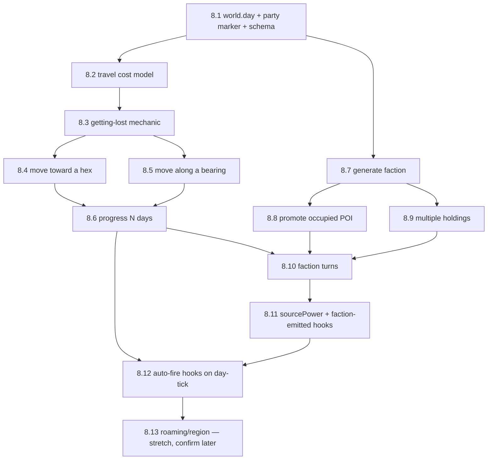

# Phase 8 — Factions (+ Travel & Party Movement)

Factions turn the generic "occupier" label (`poi.occupant = {kind:"occupied", by:"Bandits"}`) into a
real, persistent power with a **goal**, a **disposition**, and **holdings it can hold across the
whole map** — and gives it **operating rules** (goals advance, holdings grow/shrink, disposition can
shift) rather than being a static flavour string forever.

**Bundled in, on request:** a faction turn needs *something* to tick it — a unit of in-world time.
The project has no time/travel mechanic yet (Phase 6 Hooks explicitly deferred it: *"waits on a
future Exploration/Travel feature"*; backlog item 10.7 "party position marker" is explicitly
*blocked* on it). Rather than inventing an artificial clock for factions alone, **Phase 8 also
delivers a minimal party movement mechanic**: a party marker on the map, moving toward a known hex
or along a bearing into the unknown, a chance of **getting lost** off-road, and a **"progress N
days"** control for when the party sits still. This one clock then drives faction turns *and*
(Arc C) automatic hook generation over time — and it happens to ship backlog item 10.7 for free.

> Follows the project design loop: this doc is the **plan** → **approve** → build per sub-step →
> `node --test` → commit/push → manual checklist. One coherent sub-step per commit. Per the
> project's **no-back-compat directive**, schema changes are a version **stamp**, not a data
> transform — see [Hard conventions](../../PLAN.md#hard-conventions-a-new-session-must-know-these).
>
> **Working method** (mirrors `phase-4.9-dungeon-connectivity.md`): **one sub-plan file per step**
> (`docs/plans/phase-8.N-*.md`), written just before that step is built; this file is the durable
> overview. Every step ends with a manual browser checklist via `./run-local.sh`.

---

## Three arcs, in dependency order



**Arc A — Travel & Party Movement** (foundation: gives the world a clock and a party position).
**Arc B — Factions** (the core deliverable: faction objects, generation, promotion, holdings, turns).
**Arc C — Type-2 hooks** (the seam Phase 6 left open: factions emit/own hooks; hooks fire over time).

Arc A and the first half of Arc B (8.7–8.9) are independent of each other and could build in either
order; **8.10 (faction turns) needs both**. Arc C needs 8.10.

---

## Data model additions

**One schema bump for the whole phase** (v15 → **v16**, stamp-only, backfilling `day:0`,
`party:{q:0,r:0}`, `factions:[]` on old worlds) — done in **8.1**, even though faction generation
isn't built until 8.7. This mirrors how Hooks did one v6 bump up front and let the hook *shape*
self-heal via `HOOK_BUILD` afterward; the faction object shape here self-heals via a `FACTION_BUILD`
stamp the same way, so 8.7–8.10 don't need further bumps.

```js
world: {
  // ...existing fields...
  day: 0,                          // integer day counter, world clock
  party: { q: 0, r: 0 },           // single marker; multi-party is out of scope (single-GM-screen decision)
  factions: [],                    // new top-level list, sibling of hooks[]/rivers[]/roads[]
}
```

**Faction shape** (structured picks; prose composed at render, per the derived-not-stored rule —
same pattern as hooks/features):
```js
{
  id: "faction:<n>",
  name,                  // seeded derived name (js/gen/faction-name.js, same pattern as settlement-name.js)
  archetype,              // data-driven: bandits | cult | merchant guild | noble house | monstrous
                           //   tribe | hermit order | ... (data/faction-archetype.json)
  disposition,            // hostile | wary | neutral | friendly (data/faction-disposition.json)
  goal: { kind, progress, max },   // data/faction-goal.json; progress ticks on faction turns
  holdings: [ { q, r, poiId? } ],  // 1..n sites; "reuse one faction across the map"
  strength,                // abstract power/resource level; can grow/shrink on turns
  clock: { turns, sinceTurn },     // doom-clock bookkeeping; sinceTurn tracks day-of-last-tick
  origin: { fromPOI: {q,r,poiId} } | null,   // set when created via "Promote" (8.8) instead of "Generate" (8.7)
  status: "active" | "dormant" | "destroyed",
  build: FACTION_BUILD
}
```

---

## Sub-steps (build order = dependency order)

### Arc A — Travel & Party Movement

| Step | Scope |
|---|---|
| **8.1** | **Foundation: world clock + party marker.** Schema v16 (`day`, `party`, `factions:[]` reserved). Party renders on the map (distinct marker/glyph); a "Day N" readout. A stopgap "Place party here" action (any placed hex) so the slice is visible/testable before real movement (8.4/8.5) exists. |
| **8.2** | **Travel cost model** *(pure, node-only)* — `js/gen/travel.js`, a `TRAVEL_COST`/pace-per-terrain const table (illustrative starting point below), a **road discount** reusing `roads.js`'s tiers. No UI. |
| **8.3** | **Getting lost** *(pure, node-only)* — per-terrain lost chance (off-road only; always 0 on a road/track hex — see table below), rolled **once per day** of a leg; when lost, deviate to one of the two hex-directions adjacent to the intended bearing (not fully random) — reroll if the deviated hex is impassable (Sea/Lake). Deterministic via `subRng(seed, "travel", day, q, r)`. |
| **8.4** | **Move toward a hex** — GM picks a destination among **already-placed** hexes (radial/panel action "Move party here"). Engine prefers an existing **road** route (reuse the A*/`MinHeap` machinery from `roads.js`) — road travel is faster and never gets lost; off-road, steps day-by-day paying 8.2's cost and rolling 8.3's lost check. Resolves the **whole trip in one action** (like "one hook per press") and reports a short day-by-day log + final position, which may differ from the intended target if the party got lost. |
| **8.5** | **Move along a bearing** — for pushing into **unplaced** territory (no target hex to click yet): pick one of the 6 hex directions + a day count. Reuses the **lazy-tile-generation seam** (`generateHex`, same pattern as Distant hooks / dungeon lazy-build) for each new hex stepped into. Same lost/deviation rules as 8.4. |
| **8.6** | **Progress N days (stationary)** — `advanceDays(world, n)`: no movement, `world.day += n`. The hook other systems (8.10 faction turns, 8.12 auto-hooks) key off. UI: a small numeric "Progress" control next to the Day readout. |

**Illustrative starting constants** (flagged for real-play retuning, same as every other generation
constant in this project — rivers/settlements/roads all went through several retunes after manual
play):
- **Pace** (hexes/day, off-road): Plains 4 · Forest/Hills/Desert 2 · Swamp/Mountains 1 · Sea/Lake
  impassable on foot (naval travel is out of scope for Phase 8).
- **Road**: pace ×2, lost chance 0.
- **Lost chance** (per day, off-road, d6-flavoured to match the existing B/X-styled travel tooltip
  from 7.6): Plains 1-in-6 · Forest/Hills/Desert 2-in-6 · Swamp/Mountains 3-in-6.

### Arc B — Factions

| Step | Scope |
|---|---|
| **8.7** | **Foundation: Generate faction.** `js/gen/factions.js` `generateFaction`; `data/faction-archetype.json`, `data/faction-goal.json`, `data/faction-disposition.json`; `FACTION_BUILD` stamp; `js/gen/faction-name.js` (derived name, same pattern as `settlement-name.js`). A manual **"Generate faction"** action (any hex/POI — mirrors "Generate hook" at a settlement) creates a faction with one starting holding. New **Factions panel/tab** (list: name / archetype / disposition / goal — same shape as the Hooks tab from 7.3). **Holding markers render on the map from the start** (per your steer — no panel-only-first deferral), coloured/keyed per faction like the POI-dot-by-type convention from 7.9. |
| **8.8** | **Promote an occupied POI.** A radial/panel action on any POI with `occupant.kind === "occupied"` — "Promote to faction" — wraps the existing occupier label (e.g. "Bandits") into a full faction object, using the label as a seed for archetype/name so it reads as the *same* threat, not a new one. Sets `origin.fromPOI`. |
| **8.9** | **Multiple holdings.** "Claim for faction" action at any POI/hex attaches it to an existing faction's `holdings[]` — the "reuse one faction across the map" requirement (a bandit gang with three camps, a cult with a shrine *and* a hidden lair). Faction panel lists all holdings, click-to-jump like hooks' Target/Origin. |
| **8.10** | **Faction turns.** `advanceFactionTurn(world, rng)` ticks goal progress, occasional disposition drift, occasional strength/holding change, for every `active` faction. A **faction turn = N days** (proposed default **7**, tunable) — `advanceDays`/movement (8.6/8.4/8.5) auto-fires however many turns have elapsed since each faction's `clock.sinceTurn` (floor division, remainder carried, per-faction so a promoted-late faction doesn't "catch up" unfairly). A **manual "Advance faction turn" button** also exists (per your steer) for GM pacing independent of moving/waiting days. Panel shows goal progress + turn count per faction. |

### Arc C — Type-2 hooks (the seam Phase 6 left open)

| Step | Scope |
|---|---|
| **8.11** | **`sourcePower` + faction-emitted hooks.** Hooks gain an optional additive `sourcePower: "faction:<id>"` field (self-heals, no schema bump — same as any other additive hook field). A "This faction stirs up trouble" action on the Factions panel generates a normal Type-1 hook (`hooks.js`, unchanged engine) flavoured by the faction's archetype/goal and tagged back to it. |
| **8.12** | **Auto-fire hooks on day-tick.** Per Phase 6's forward-hook note — once travel exists, hooks can fire automatically as days pass. On `advanceDays`, a small per-day chance (scaled by **proximity × faction strength** — "news propagation by distance": a nearby faction's deeds are common gossip, a distant one a rare whisper) spawns a hook without a button press, surfacing in the existing Hooks list exactly like a manual one. |
| **8.13** | *(Stretch — confirm after 8.11/8.12 ship whether still wanted, may slip to Phase 9/10)* **Roaming targets / region disturbance.** A hunted faction's lair hex can drift over turns; a vague region-wide "something is stirring" flavour hook (malign or benign, per Phase 6's note). Meaningfully bigger scope (needs a "move a holding" concept + a fuzzy area-hook pattern) — flagging rather than committing now. |

---

## Decided (from review)
1. **Origination** — both a manual **"Generate faction"** action and **"Promote"** an existing
   occupied POI into a faction (8.7 + 8.8).
2. **Turn mechanic** — manually GM-paced (an "Advance faction turn" button), **plus** a bundled
   party-movement mechanic whose day-ticks drive turns automatically too (Arc A → 8.10).
3. **Movement mode** — both **toward a known hex** (8.4, road-aware) and **along a bearing** into
   unplaced territory (8.5); **getting lost** is a real per-day, per-terrain chance (8.3), always 0
   on a road, and roads are also faster.
4. **Type-2 hooks** — yes, as a later sub-phase (8.11–8.12) once the faction object exists, using the
   `sourcePower` seam Phase 6 left open.
5. **Map presence** — faction holding markers ship **from the first slice** (8.7), not deferred to a
   later polish step (contrast with Hooks, which shipped panel-first and markers later).

## Open items to confirm when this doc is approved
- **Faction-turn length** (proposed 7 days/turn) and all the Arc A pace/lost-chance numbers above are
  starting points, expected to be retuned after real play — flagging so nobody reads them as final.
- **Naval travel** (crossing Sea/Lake) is out of scope for Phase 8; movement routes around water like
  roads already do.
- **Multi-party** is out of scope (single-GM-screen foundational decision) — `world.party` stays a
  single marker.
- Exact **radial-menu placement** for the new actions (Move party / Generate faction / Promote /
  Claim holding / Advance faction turn) isn't decided yet — the ring's slots are mostly spoken for
  (River/Road already reused the old "reserved" slot); likely a mix of new submenus under existing
  slots and one or two command-bar buttons (Day readout + Progress + Advance faction turn feel more
  at-home in the command bar than the ring, similar to how Legend became a pinned button in 3R.8).
  Worked out per-step, not blocking this plan.

---

## Files (anticipated)
- **`js/gen/travel.js`** *(new, pure)* — `TRAVEL_COST`, `rollGetLost`, `deviateDirection`,
  `planMoveToward`, `stepDirection`, `advanceDays`.
- **`js/gen/factions.js`** *(new, pure)* — `generateFaction`, `promoteFaction`, `addHolding`,
  `advanceFactionTurn`, `FACTION_BUILD`.
- **`js/gen/faction-name.js`** *(new, pure)* — derived seeded faction names (mirrors `settlement-name.js`).
- **`/data`** *(new tables)* — `faction-archetype.json`, `faction-goal.json`, `faction-disposition.json`.
- **`js/world/world.js`** — `SCHEMA_VERSION = 16`; `day`/`party`/`factions` fields + accessors
  (`addFaction`/`removeFaction`/`getFactions`/`setPartyPosition`).
- **`js/data/portability.js`** — one stamp-only migration step (v15→v16 backfill); export/import
  carries `day`/`party`/`factions`.
- **`js/ui/panel.js`** — new **Factions** tab (list, generate/promote/claim, holdings, turn/goal
  readout); a party/day readout + Progress control.
- **`js/ui/app.js`** — wire move/generate/promote/claim/advance-turn dispatch; day-tick → faction-turn
  + auto-hook hooks (8.10/8.12); lazy target-tile seam reuse for 8.5.
- **`js/ui/map.js`** — party marker rendering; faction holding markers (coloured per faction, per-type
  glyph reuse from `poi-style.js`).
- **`/test`** — `travel.test.js`, `factions.test.js`, plus `migration.test.js` updates.

## Reuse (don't fork)
`subRng`/`rollTable`/`loadTables`; `hexgeo.js` (bearing/direction, `axialLine`, `axialDistance` —
already powers Distant hooks); `roads.js`'s A\*/`MinHeap` (`js/core/minheap.js`) for road-preferring
routes; the **lazy-build seam** in `app.js` (dungeon/tower/hook pattern) for 8.5's frontier stepping;
`terrain-profile.js`'s bias-const convention for `TRAVEL_COST`/lost-chance tables (rules as JS consts,
not JSON, per the [data-driven-content convention](../../PLAN.md#hard-conventions-a-new-session-must-know-these));
`settlement-name.js`'s derived-name pattern for faction names; the **compose-at-render** prose
approach from `feature-detail.js`/hooks; **panel-tabs** (7.3) for the new Factions tab; the
**POI-dot-by-type** convention (7.9) for faction holding markers; `hooks.js`'s existing engine
unchanged for 8.11's faction-emitted hooks.

## Tests (`node --test`, pure logic only)
- **Travel:** determinism (same seed/day/position → identical lost roll); road legs never roll lost
  and are faster; off-road pace matches the terrain table; deviation picks an adjacent bearing, never
  the exact opposite, and never lands on impassable terrain; `stepDirection` generates exactly the
  hexes it steps into, leaves the rest unplaced; `advanceDays` is a pure day-counter bump.
- **Factions:** `generateFaction` returns a well-formed faction from the tables; `promoteFaction`
  preserves the source POI's occupant flavour as a seed; `addHolding` dedupes; `advanceFactionTurn` is
  deterministic and only progresses factions whose elapsed days ≥ one turn length; turn math handles a
  faction created mid-timeline (doesn't "catch up" unfairly).
- **Migration/portability:** v15 world upgrades to v16 with `day:0`, `party:{0,0}`, `factions:[]`;
  export→import round-trips a world carrying party/day/factions; `schemaVersion` current.

## Verification (manual, per step, via `./run-local.sh`)
```
8.1  [ ] New/loaded world shows a party marker + "Day 0"; "Place party" moves it; reload persists
8.2  [ ] (node-only — no manual step)
8.3  [ ] (node-only — no manual step)
8.4  [ ] "Move party here" on a distant known town → day-by-day log, party arrives (or ends up
         lost nearby); a road route is visibly faster and never reports "lost"
8.5  [ ] Pick a bearing + N days from the map edge → N new hexes generated along the path, party
         ends there; a lost roll visibly bends the path at least sometimes over repeated tries
8.6  [ ] "Progress 5 days" → Day +5, party doesn't move
8.7  [ ] "Generate faction" → appears in the Factions tab with name/archetype/disposition/goal;
         its holding shows a marker on the map; reload + export→import → identical (schema v16)
8.8  [ ] "Promote to faction" on an occupied camp → a faction appears carrying that occupier's flavour
8.9  [ ] "Claim for faction" on a second POI → same faction now lists two holdings; both marked on map
8.10 [ ] "Advance faction turn" → goal progress/clock moves; moving/progressing enough days
         auto-advances turns the same way
8.11 [ ] Factions panel "stirs up trouble" → a normal hook appears, tagged to the faction
8.12 [ ] Progress many days near an active faction → occasionally a hook appears with no button press
```

---

## Forward hooks (beyond Phase 8)
- **Naval travel** (boats, crossing Sea/Lake) — needs its own mechanic; out of scope here.
- **Multi-party / faction-vs-faction conflict resolution** — this phase gives factions goals and
  holdings but not a combat/contest resolver between two factions; noted for a future phase if wanted.
- **8.13 roaming/region hooks** — may slip out of Phase 8 entirely; revisit after 8.11/8.12.
- **Weather / calendar** — the Phase 9 small-oracle catalog already lists "calendar / time & travel
  tracker"; Phase 8's `world.day` counter is the natural foundation for it, not a duplicate — Phase 9
  should build **on** `world.day`, not invent a second clock.
